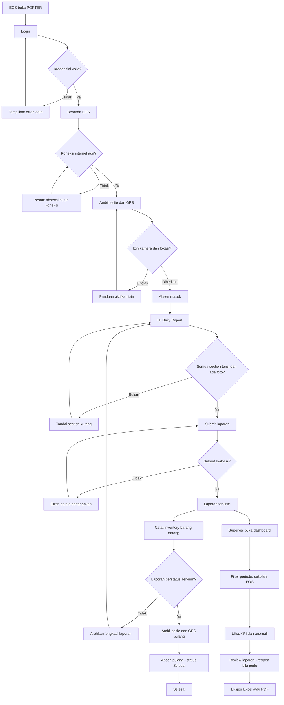
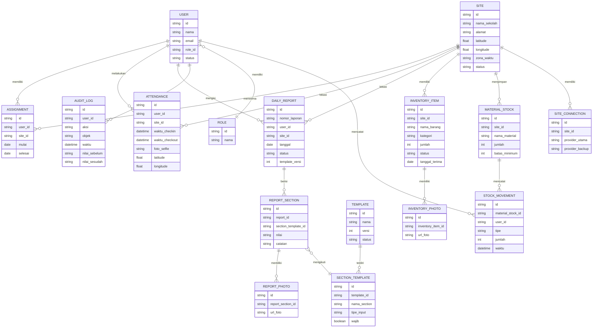

# PRD — PORTER (Portal Operasional Terpadu)

## Pendahuluan / Gambaran Umum

PORTER (Portal Operasional Terpadu) adalah aplikasi berbasis web (PWA) untuk memantau operasional harian Engineer On Site (EOS) di sekolah-sekolah Sekolah Rakyat yang tersebar di seluruh Indonesia. Saat ini Comtronics menempatkan satu EOS di setiap site (sekitar 200+ sekolah, dari WIB hingga WIT) untuk merawat infrastruktur jaringan sekolah seperti router, firewall, access point (AP), UPS, dan perangkat pendukung lainnya.

Kondisi saat ini: Supervisi tidak memiliki visibilitas terhadap kehadiran EOS, kondisi perangkat dan jaringan, stok material, maupun inventaris perangkat per site. Data tersebar di chat dan Excel dengan format laporan yang tidak konsisten antar site dan antar engineer, sehingga sulit direkap dan ditelusuri historisnya.

PORTER menyatukan empat fungsi utama dalam satu sistem:
1. **Bukti kehadiran EOS** melalui absen masuk/pulang dengan selfie dan GPS.
2. **Daily Report** terstruktur dengan checklist pemeriksaan yang seragam dan dapat direvisi.
3. **Inventory per site** yang dicatat oleh EOS saat barang datang dari gudang pusat, termasuk stok material habis pakai.
4. **Dashboard KPI Supervisi** dengan filter periode, sekolah, dan EOS, serta ekspor ke Excel/PDF.

Aplikasi digunakan oleh 4 peran: EOS, Supervisi, HR, dan Administrator. Sistem menyimpan data runtime (akun, absensi, laporan, inventory, audit log) sehingga memerlukan basis data operasional.

## Tujuan

1. **Visibilitas kehadiran**: Mencapai 95% EOS melakukan check-in harian tercatat di PORTER dalam 3 bulan pertama setelah rilis.
2. **Kelengkapan laporan**: Mencapai 90% site mengirim Daily Report lengkap (semua section terisi) setiap hari kerja dalam 3 bulan pertama.
3. **Konsistensi data**: 100% laporan harian menggunakan template seragam yang dikelola Administrator, sehingga perbandingan antar site dapat dilakukan tanpa normalisasi manual.
4. **Akurasi inventory**: 100% barang yang diterima dari gudang pusat tercatat di PORTER dengan foto dan status (dipakai/cadangan/rusak/dikembalikan) dalam 2x24 jam sejak kedatangan.
5. **Kecepatan analisis**: Supervisi dapat menghasilkan rekap KPI lintas site (kehadiran, laporan, jaringan, lingkungan, anomali, inventory) dalam waktu < 5 menit melalui dashboard dan ekspor, dibandingkan rekap manual saat ini.
6. **Auditabilitas**: 100% aktivitas penting (login, absen, submit laporan, perubahan inventory, perubahan master data, perubahan penempatan EOS) tercatat dalam audit log dengan identitas pelaku dan waktu.

## Cerita Pengguna

1. **Sebagai EOS**, saya ingin melakukan absen masuk dan pulang dengan selfie dan lokasi GPS, supaya ada bukti bahwa saya benar-benar berada di sekolah pada hari itu.
2. **Sebagai EOS**, saya ingin mengisi Daily Report dengan checklist yang sama setiap hari, supaya saya tidak perlu mengingat format laporan dan hasilnya bisa dibandingkan antar site.
2a. **Sebagai EOS**, saya ingin bisa memperbaiki laporan saya sendiri di hari yang sama jika ada kesalahan, supaya laporan saya akurat tanpa perlu meminta bantuan.
3. **Sebagai EOS**, saya ingin mencatat barang yang datang dari gudang pusat beserta fotonya dan status penggunaannya, supaya inventaris sekolah tercatat rapi dan tidak hilang.
4. **Sebagai Supervisi**, saya ingin melihat dashboard KPI yang bisa difilter per periode, sekolah, dan EOS, supaya saya bisa mengidentifikasi site bermasalah dan menindaklanjutinya.
5. **Sebagai Supervisi**, saya ingin membuat akun EOS dan menempatkannya ke sekolah tertentu (termasuk memindahkan atau mengakhiri penugasan), supaya penugasan selalu sesuai kebutuhan operasional.
6. **Sebagai Supervisi**, saya ingin memeriksa laporan harian dan inventory, serta membuka ulang laporan yang bermasalah agar EOS memperbaikinya, supaya data yang masuk ke dashboard akurat.
7. **Sebagai HR**, saya ingin melihat data kehadiran EOS beserta profil dan penempatan site-nya, supaya kebutuhan ketenagakerjaan dapat dianalisis.
8. **Sebagai Administrator**, saya ingin mengelola template laporan harian dan data master, supaya standar pemeriksaan dapat direvisi ketika kebutuhan berubah.
9. **Sebagai Administrator**, saya ingin melihat log aktivitas/audit sistem, supaya setiap masalah dapat dilacak siapa melakukan apa dan kapan.

## Kebutuhan Fungsional

### Autentikasi dan Manajemen Pengguna

- **FR-1**: Sistem harus menyediakan autentikasi berbasis akun (email/username + kata sandi) untuk 4 peran: EOS, Supervisi, HR, Administrator. Setiap pengguna hanya dapat mengakses fitur sesuai perannya.
- **FR-2**: Supervisi dan Administrator harus dapat membuat akun pengguna baru, termasuk akun EOS. Saat pembuatan akun EOS, Supervisi wajib menetapkan sekolah penempatan. Tidak ada pendaftaran mandiri (registrasi publik dinonaktifkan); semua akun dibuat oleh Supervisi atau Administrator. Akun baru menerima password sementara dan wajib menggantinya pada login pertama.
- **FR-3**: Supervisi dan Administrator harus dapat memindahkan EOS ke sekolah lain dan mengakhiri penugasan. Riwayat penempatan (sekolah, tanggal mulai, tanggal selesai) harus tersimpan. Satu EOS hanya dapat memiliki satu penugasan aktif pada satu waktu, dan satu sekolah hanya memiliki satu EOS aktif; penugasan berurutan (historis) boleh lebih dari satu.
- **FR-4**: Jika kredensial salah, sistem menampilkan pesan error "Email atau kata sandi salah" tanpa mengungkap bagian mana yang salah. Setelah 5 kali gagal berturut-turut, akun terkunci sementara selama 15 menit.
- **FR-4a**: Pengguna yang lupa kata sandi dapat mereset melalui tautan yang dikirim ke email terdaftar (reset via email). Supervisi dan Administrator juga dapat mengatur ulang kata sandi pengguna; setelah diatur ulang, pengguna wajib mengganti kata sandi pada login berikutnya.

### Absensi EOS (Selfie + GPS)

- **FR-5**: EOS harus dapat melakukan absen masuk dan absen pulang, masing-masing dengan satu selfie dan koordinat GPS perangkat (selfie absen masuk dan selfie absen pulang adalah dua foto terpisah).
- **FR-5a**: Layar kamera absensi menampilkan overlay panduan wajah (lingkaran/oval di tengah preview). Bila browser mendukung FaceDetector API, wajah harus terdeteksi di dalam area panduan sebelum tombol jepret aktif; bila API tidak tersedia, absensi tetap dapat dilakukan dengan overlay panduan saja. Tidak ada pengenalan identitas (face recognition) dan tidak ada data biometrik yang disimpan — deteksi hanya memastikan ada wajah.
- **FR-5b**: Foto selfie yang disimpan server diberi watermark permanen di bagian bawah gambar berisi: tanggal-jam saat server menerima (zona waktu lokal site), koordinat GPS (latitude, longitude + accuracy), dan nama site. Watermark dicap server (bukan client) sehingga tidak dapat dimanipulasi perangkat. Foto asli tanpa watermark tidak perlu disimpan; file yang tersimpan adalah file berwatermark.
- **FR-6**: Absensi hanya dapat dilakukan saat perangkat memiliki koneksi internet aktif. Jika tidak ada koneksi, sistem menampilkan pesan "No internet connection. Attendance requires an internet connection." dan tombol absen dinonaktifkan.
- **FR-7**: Sistem harus mencatat waktu absen dalam zona waktu lokal sekolah (WIB/WITA/WIT) dan menyimpan waktu server (UTC) sebagai referensi.
- **FR-8**: Sistem harus mencegah absen masuk ganda pada hari yang sama untuk EOS yang sama. Jika EOS sudah absen masuk, tombol absen masuk dinonaktifkan dan status "Checked In" ditampilkan.
- **FR-9**: Sistem harus mencegah absen pulang sebelum absen masuk. Jika belum check-in, tombol absen pulang dinonaktifkan dengan pesan "You haven't checked in today."
- **FR-9a**: EOS tidak dapat absen pulang sebelum Daily Report pada tanggal lokal tersebut berstatus "Submitted". Jika EOS mencoba absen pulang saat laporan belum terkirim, sistem tidak menampilkan penolakan mentah, melainkan mengarahkan EOS untuk melengkapi dan mengirim laporan terlebih dahulu.
- **FR-9b**: Setelah absen pulang berhasil, status kehadiran menjadi "Completed" dan percobaan absen pulang berikutnya pada hari yang sama ditolak.
- **FR-9c**: Absen masuk dan absen pulang harus terjadi pada tanggal lokal sekolah yang sama; shift lintas tengah malam tidak didukung.
- **FR-10**: Jika izin kamera atau lokasi ditolak, sistem menampilkan pesan panduan untuk mengaktifkan izin tersebut dan absensi tidak dapat dilanjutkan.
- **FR-11**: Saat proses unggah selfie/GPS sedang berjalan, sistem menampilkan indikator loading dan mencegah pengiriman ganda.
- **FR-12**: Jika unggahan gagal (timeout/server error), sistem menampilkan pesan error dan tombol "Try Again" tanpa menghilangkan data selfie/GPS yang sudah diambil.
- **FR-12a**: Supervisi, Administrator, dan HR dapat melihat riwayat kehadiran per EOS dan per site (tanggal, jam absen masuk/pulang sesuai zona waktu lokal sekolah, status, lokasi, dan foto selfie) dengan filter periode. EOS hanya melihat riwayat miliknya sendiri. Halaman ini menjadi konteks utama akses foto selfie sesuai FR-48.
- **FR-13**: PORTER hanya menyimpan bukti kehadiran. Sistem tidak menghitung keterlambatan, tidak menghitung potongan gaji, tidak menegakkan batas jam absen masuk/pulang, dan tidak terintegrasi dengan sistem absensi vendor EOS.

### Daily Report

- **FR-14**: Sistem harus menyediakan template Daily Report yang dikelola Administrator, terdiri dari section: Info Umum, Router & Firewall, Access Point, Infrastruktur & Lingkungan, dan Konektivitas Dual-Link.
- **FR-15**: Section Info Umum harus terisi otomatis oleh sistem: nomor laporan, tanggal (zona waktu lokal sekolah), nama sekolah, dan nama EOS.
- **FR-16**: Section Router & Firewall harus menangkap: uptime perangkat, utilisasi CPU (%), utilisasi RAM (%), dan status log anomali (tidak ada / minor / mayor / tidak dicek). Jika status anomali adalah minor atau mayor, EOS wajib mengisi penjelasan dan melampirkan minimal 1 foto.
- **FR-17**: Section Access Point harus menangkap: status monitoring AP (normal/warning/down/tidak diketahui), jumlah AP offline (angka ≥ 0), dan minimal 1 dokumentasi/screenshot monitoring AP dari cloud.
- **FR-18**: Section Infrastruktur & Lingkungan harus menangkap: kondisi kelistrikan (normal/tidak stabil/mati/backup aktif), suhu ruangan server (dalam °C), dan kondisi lingkungan ruangan (baik/perlu perhatian/tidak layak). Jika kondisi kelistrikan bukan "normal" atau kondisi lingkungan bukan "baik", EOS wajib mengisi penjelasan dan melampirkan minimal 1 foto.
- **FR-19**: Section Konektivitas Dual-Link harus menangkap untuk link utama dan link backup secara terpisah: traffic rata-rata dan puncak (download dan upload), serta hasil uji kecepatan (download, upload, latency, jitter, packet loss). Setiap link wajib melampirkan minimal 1 screenshot hasil speedtest.
- **FR-20**: Setiap section wajib dilengkapi minimal 1 foto bukti. Sistem tidak mengizinkan submit jika ada section yang kosong atau tidak memiliki foto.
- **FR-20a**: Aturan foto/lampiran: format diizinkan JPG/JPEG, PNG, WebP, HEIC/HEIF, dan PDF (PDF tidak untuk selfie); maksimal 10 MB per file; maksimal 1 foto selfie per absen masuk dan 1 per absen pulang; maksimal 5 foto per section; maksimal 10 foto total per Daily Report. Foto yang tidak memenuhi aturan ditolak pada saat unggah dengan pesan yang menjelaskan alasannya.
- **FR-21**: EOS harus dapat menyimpan Daily Report sebagai draf dan melanjutkannya sebelum submit. Draf tersimpan di server (memerlukan koneksi), bukan di perangkat EOS, dan tidak dihitung sebagai laporan terkirim pada dashboard.
- **FR-22**: Saat submit berhasil, sistem menampilkan konfirmasi "Report submitted successfully" beserta nomor laporan, dan laporan berstatus "Submitted".
- **FR-22a**: Nomor laporan resmi berformat `CMX.WR.YYYYMM.SEQUENCE` (contoh: `CMX.WR.202610.0001`). YYYYMM diambil dari tanggal lokal sekolah saat submit; sequence berurutan global tanpa reset dan terus bertambah (setelah 9999 menjadi 10000). Nomor diterbitkan hanya saat submit berhasil, bersifat unik permanen, tidak pernah dipakai ulang, dan tidak berubah saat laporan direvisi atau dibuka ulang. Draf tidak memiliki nomor resmi.
- **FR-23**: Jika submit gagal karena koneksi terputus, sistem menampilkan pesan error dan mempertahankan seluruh isian serta foto agar EOS dapat mencoba lagi.
- **FR-24**: EOS dapat merevisi laporan miliknya sendiri yang berstatus "Submitted" pada hari yang sama dengan tanggal laporan (tanggal lokal sekolah). Setiap revisi menambah hitungan revisi pada laporan; nomor laporan tidak berubah. Supervisi dan Administrator dapat membuka ulang (reopen) laporan menjadi status "Needs Revision" kapan pun dengan alasan wajib, sehingga EOS dapat memperbaikinya. Semua perubahan status dan isi laporan tercatat di audit log (siapa, kapan, field apa, nilai sebelum dan sesudah). EOS menerima notifikasi in-app ketika laporannya dibuka ulang.
- **FR-25**: Administrator harus dapat merevisi template Daily Report (menambah/mengubah/menghapus pertanyaan). Perubahan template hanya berlaku untuk laporan baru; setiap laporan menyimpan salinan (snapshot) definisi template yang digunakan saat dibuat, sehingga laporan lama tidak berubah. Perbandingan lintas versi di dashboard hanya menggunakan field inti yang stabil (utilisasi CPU/RAM, AP offline, suhu, speedtest); item yang dihapus dari template tidak dipakai pada KPI baru namun datanya tetap tersimpan.
- **FR-26**: Sistem harus menampilkan daftar laporan harian dengan filter tanggal, sekolah, EOS, dan status (draf/terkirim/direvisi). Jika tidak ada data, tampilkan empty state "No reports found for this filter."

### Inventory per Site

- **FR-27**: EOS harus dapat mencatat barang yang datang dari gudang pusat ke site-nya, lengkap dengan nama barang, kategori, jumlah, tanggal terima, dan minimal 1 foto barang.
- **FR-28**: Setiap barang harus memiliki status: `dipakai`, `cadangan`, `rusak`, `dikembalikan`, atau `hilang`. EOS dapat mengubah status barang; perubahan ke status `rusak` atau `hilang` wajib disertai alasan, dan semua perubahan status tercatat di audit log.
- **FR-29**: Sistem harus mencatat stok material habis pakai per sekolah, termasuk transaksi barang masuk, barang keluar, dan pemakaian. Stok tidak boleh bernilai negatif: transaksi yang membuat saldo melebihi stok tersedia ditolak dengan pesan yang menjelaskan saldo saat ini.
- **FR-30**: Sistem harus menampilkan rekap stok material menipis **hanya di dashboard** (material dengan jumlah stok paling rendah), tanpa konfigurasi ambang batas minimum dan tanpa notifikasi push ke HP.
- **FR-31**: Inventory terikat pada sekolah, bukan pada EOS. Jika EOS dipindahkan ke sekolah lain, data inventory tetap menjadi milik sekolah asal.
- **FR-32**: Supervisi dan Administrator harus dapat mengoreksi data inventory. Setiap koreksi tercatat di audit log.
- **FR-33**: Jika daftar inventory kosong, sistem menampilkan empty state "No items recorded at this site yet."

### Master Data Site

- **FR-34**: Administrator harus dapat mengelola master data site: nama sekolah, alamat, titik koordinat (latitude/longitude), zona waktu (WIB/WITA/WIT), dan data koneksi internet (provider utama dan provider backup).
- **FR-35**: Sistem harus menampilkan tanggal dan jam sesuai zona waktu lokal masing-masing sekolah di seluruh tampilan (absensi, laporan, dashboard, ekspor).
- **FR-36**: Administrator harus dapat menonaktifkan site yang tidak lagi aktif tanpa menghapus data historisnya.

### Dashboard dan Analitik KPI

- **FR-37**: Dashboard harus dapat difilter berdasarkan periode (rentang tanggal), sekolah, dan EOS. Filter dapat dikombinasikan.
- **FR-38**: Dashboard harus menampilkan KPI kehadiran: persentase EOS yang check-in per hari, jumlah EOS yang belum absen pulang, dan tren kehadiran per site.
- **FR-39**: Dashboard harus menampilkan KPI kelengkapan laporan: persentase Daily Report terkirim vs belum, dan daftar site yang belum mengirim laporan pada hari tersebut.
- **FR-40**: Dashboard harus menampilkan KPI kesehatan jaringan: tren utilisasi CPU/RAM router per site, jumlah AP offline, tren traffic dan hasil speedtest per link, serta perbandingan performa antar site.
- **FR-41**: Dashboard harus menampilkan KPI kondisi lingkungan: tren suhu ruangan server per site dan kejadian listrik bermasalah.
- **FR-42**: Dashboard harus menampilkan rekap anomali: log anomali mayor, AP down, kelistrikan bermasalah, dan lingkungan tidak layak, sebagai sinyal site yang perlu ditindaklanjuti.
- **FR-43**: Dashboard harus menampilkan KPI inventory: jumlah aset berstatus `rusak` dan `hilang` per site dan rekap stok material yang menipis.
- **FR-44**: Supervisi dan Administrator harus dapat mengekspor rekap dashboard ke Excel dan PDF sesuai filter yang aktif.
- **FR-45**: Saat data dashboard sedang dimuat, sistem menampilkan indikator loading. Jika tidak ada data pada filter yang dipilih, tampilkan empty state "No data for this filter."

### Audit Log

- **FR-46**: Sistem harus mencatat audit log untuk aktivitas penting: login, absen masuk/pulang, submit laporan, koreksi laporan, perubahan inventory, perubahan master data, perubahan penempatan EOS, dan perubahan template laporan. Setiap entri memuat: pelaku, peran, aksi, objek, waktu (UTC dan zona waktu lokal), dan nilai sebelum/sesudah jika relevan.
- **FR-47**: Administrator harus dapat melihat dan memfilter audit log berdasarkan periode, pelaku, dan jenis aksi.

### Hak Akses Foto

- **FR-48**: Akses foto diatur per jenis data: (a) foto selfie absensi — EOS pemilik data, Supervisi, Administrator, dan HR (untuk keperluan ketenagakerjaan); (b) foto bukti laporan dan foto inventory — EOS pemilik data, Supervisi, dan Administrator; HR tidak dapat melihatnya. Role tanpa akses ke data terkait tidak dapat melihat foto tersebut.
- **FR-49**: Setiap akses terhadap foto selfie dan foto bukti harus tercatat di audit log.

## Alur Pengguna

Alur berikut menggambarkan perjalanan utama EOS dari login hingga laporan terkirim, serta jalur alternatif ketika koneksi bermasalah atau data belum lengkap. Alur Supervisi untuk review dan analisis juga ditampilkan.

## Diagram Relasi Entitas (ERD)

PORTER menyimpan data runtime sehingga memerlukan basis data operasional. Entitas utama mencakup pengguna dan peran, penempatan EOS, absensi, laporan harian beserta section dan foto bukti, inventory per site, stok material, master data site, template laporan, dan audit log. Diagram berikut bersifat konseptual dan tidak menampilkan seluruh kolom teknis.

## Bukan Tujuan (Di Luar Cakupan)

1. **Perhitungan keterlambatan dan penggajian**: PORTER hanya menyimpan bukti kehadiran. Perhitungan keterlambatan, potongan gaji, dan integrasi dengan sistem absensi vendor EOS tidak termasuk.
2. **Mode offline penuh**: Absensi dan laporan harian memerlukan koneksi internet. PORTER tidak menyediakan sinkronisasi offline untuk absensi/laporan.
3. **Notifikasi push ke HP**: Peringatan stok menipis hanya muncul di dashboard, tanpa notifikasi push.
4. **Manajemen pengadaan dan pembelian**: PORTER mencatat barang yang sudah datang dari gudang pusat, bukan proses pengadaan atau pembelian.
5. **Monitoring perangkat secara real-time langsung dari perangkat**: Data perangkat (CPU, RAM, uptime) diinput manual oleh EOS berdasarkan pemeriksaan, bukan diambil otomatis via protokol monitoring.
6. **Aplikasi native iOS/Android**: PORTER berbentuk PWA, bukan aplikasi native.
7. **Manajemen kontrak vendor atau SLA**: Tidak termasuk dalam cakupan versi ini.
8. **Chat atau kolaborasi internal**: Komunikasi antar pengguna tidak disediakan di PORTER.

## Pertimbangan Desain

1. **Mobile-first**: EOS dominan menggunakan HP di lapangan. Antarmuka absensi dan Daily Report harus dioptimalkan untuk layar kecil, tombol besar, dan alur singkat.
2. **PWA**: Aplikasi harus dapat dipasang di layar utama HP (installable), memiliki ikon, splash screen, dan tampilan seperti aplikasi. Service worker digunakan untuk caching aset statis agar pemuatan cepat, namun absensi dan submit laporan tetap memerlukan koneksi.
3. **Ringan di koneksi lambat**: Ukuran aset minimal, kompresi foto sebelum unggah, dan indikator progres unggah yang jelas.
4. **Zona waktu**: Semua tanggal dan jam ditampilkan sesuai zona waktu lokal sekolah. Pengguna yang mengelola banyak site harus dapat melihat label zona waktu agar tidak salah tafsir.
5. **Form Daily Report**: Gunakan struktur section yang jelas dengan indikator kelengkapan per section. Section yang belum lengkap ditandai visual (misalnya warna berbeda) dan tombol submit dinonaktifkan sampai semua section terisi.
6. **Dashboard**: Gunakan grafik yang mudah dibaca (line chart untuk tren, bar chart untuk perbandingan antar site). Filter periode, sekolah, dan EOS harus terlihat jelas dan dapat direset.
7. **Privasi foto**: Foto selfie dan foto bukti ditampilkan hanya pada konteks data terkait. Gunakan akses berbasis peran dan catat setiap akses.
8. **Empty state dan error state**: Setiap daftar (laporan, inventory, dashboard) harus memiliki empty state yang informatif dan pesan error yang menjelaskan langkah berikutnya.
9. **Konsistensi bahasa**: Seluruh antarmuka (copy UI) menggunakan Bahasa Inggris — kode, komentar, copy UI, dan test assertion dalam Bahasa Inggris; komunikasi dengan pemilik produk dalam Bahasa Indonesia. Copy UI disimpan sebagai translation string agar mudah dilokalkan kelak.

## Pertimbangan Teknis

1. **Arsitektur**: Satu aplikasi web full-stack Laravel 13 + Inertia + React dengan server-side routing (mengikuti project existing), bukan frontend-backend terpisah dengan REST API. Seluruh interaksi browser melewati routing server-side; tidak ada API layer terpisah.
2. **Basis data**: Basis data relasional untuk menyimpan pengguna, peran, penempatan, absensi, laporan, inventory, stok, master data, template, dan audit log. Skema harus mendukung riwayat (penempatan, versi template, pergerakan stok).
3. **Autentikasi dan otorisasi**: Autentikasi berbasis session cookie (server-side). Otorisasi berbasis peran (RBAC) dengan 4 peran: EOS, Supervisi, HR, Administrator. Administrator memiliki semua akses Supervisi ditambah pengelolaan template, master data, dan audit log. Pemeriksaan hak akses dilakukan server-side pada setiap request, tidak cukup pada penyembunyian tombol di UI.
4. **Penyimpanan foto**: Foto selfie dan foto bukti disimpan di storage privat server (di luar direktori publik). Setiap akses foto melewati endpoint aplikasi yang memeriksa hak akses role terlebih dahulu, mencatat akses di audit log, kemudian mengirimkan file — tidak ada URL foto yang dapat diakses langsung dari luar.
5. **Zona waktu**: Simpan waktu dalam UTC di basis data. Konversi ke zona waktu lokal sekolah dilakukan di lapisan aplikasi berdasarkan `zona_waktu` pada master data site.
6. **Validasi**: Validasi wajib dilakukan di sisi klien dan server. Server menolak submit laporan jika ada section kosong atau foto bukti tidak ada.
7. **Audit log**: Penulisan audit log dilakukan secara otomatis pada setiap aksi penting. Audit log bersifat append-only (tidak dapat diubah atau dihapus oleh pengguna aplikasi).
8. **Ekspor**: Ekspor Excel dan PDF dihasilkan di sisi server berdasarkan filter yang aktif, dengan batas ukuran dan waktu proses yang wajar.
9. **Kinerja**: Dashboard harus merespons dalam < 3 detik untuk filter umum. Query agregasi KPI sebaiknya menggunakan tabel ringkasan atau materialized view yang diperbarui berkala.
10. **Keamanan**: Kata sandi disimpan dengan hashing yang kuat. Pembatasan percobaan login untuk mencegah brute force. Validasi input untuk mencegah injeksi.
11. **Skalabilitas**: Sistem harus mendukung 200+ site dan terus bertambah, dengan potensi ribuan laporan per bulan. Desain basis data dan indeks harus mempertimbangkan pertumbuhan ini.
12. **Ketersediaan**: Karena absensi dan laporan memerlukan koneksi, backend harus memiliki ketersediaan tinggi. Jika backend tidak dapat diakses, aplikasi menampilkan pesan error yang jelas dan tidak kehilangan data yang sudah diisi di klien.
13. **Backup**: Data operasional (basis data dan foto tersimpan) wajib dibackup otomatis setiap hari, dan prosedur restore harus teruji sebelum go-live. Detail mekanisme backup dan restore adalah bagian dokumen operasional.
14. **Pengujian**: Aturan bisnis kritikal — pencegahan absen ganda, gate Daily Report sebelum absen pulang, pencegahan absen pulang ganda, alokasi nomor laporan, dan pemeriksaan hak akses foto — wajib dijaga oleh test otomatis. Strategi pengujian lengkap menjadi dokumen terpisah.
15. **Deployment**: Source code dikelola di GitHub; setiap rilis terpasang melalui Dokploy. Strategi environment dan pipeline rilis adalah bagian dokumen operasional.

## Metrik Keberhasilan

| Metrik | Target | Cara Ukur |
|---|---|---|
| Persentase EOS check-in harian | ≥ 95% dalam 3 bulan pertama | Jumlah check-in / jumlah EOS aktif per hari |
| Persentase site mengirim Daily Report lengkap | ≥ 90% per hari kerja dalam 3 bulan pertama | Jumlah laporan terkirim lengkap / jumlah site aktif |
| Waktu rata-rata pengisian Daily Report | ≤ 15 menit per laporan | Selisih waktu mulai dan submit laporan |
| Persentase barang gudang tercatat dalam 2x24 jam | 100% | Waktu pencatatan inventory vs waktu kedatangan barang |
| Waktu Supervisi menghasilkan rekap KPI | ≤ 5 menit | Waktu dari buka dashboard hingga ekspor selesai |
| Tingkat keberhasilan submit laporan | ≥ 98% | Submit berhasil / total percobaan submit |
| Cakupan audit log aktivitas penting | 100% | Jumlah aksi penting tercatat / total aksi penting |
| Kepuasan pengguna EOS terhadap kemudahan absensi | ≥ 4 dari 5 | Survei internal |
| Jumlah site bermasalah berulang yang teridentifikasi | ≥ 80% dari total site bermasalah | Perbandingan temuan dashboard vs temuan manual |

## Keputusan Produk (Hasil Konfirmasi)

Pertanyaan-pertanyaan terbuka berikut telah dikonfirmasi oleh pemilik produk dan menjadi keputusan final:

1. **Ambang batas stok minimum**: Tidak ada ambang batas di versi ini. Dashboard hanya menampilkan rekap stok terendah (lihat FR-30).
2. **Koreksi laporan**: EOS merevisi laporan miliknya sendiri pada hari yang sama; Supervisi/Administrator dapat membuka ulang laporan dengan alasan wajib kapan pun diperlukan (lihat FR-24). EOS menerima notifikasi in-app saat laporannya dibuka ulang.
3. **Versi template laporan**: Laporan menyimpan snapshot template saat dibuat; dashboard hanya membandingkan field inti yang stabil (lihat FR-25).
4. **Batas waktu absen**: Tidak ada batas jam absen masuk/pulang. PORTER hanya menyimpan bukti kehadiran; disiplin jam kerja ditangani sistem absensi vendor EOS (lihat FR-13).
5. **Penghapusan data**: Foto selfie dan foto bukti disimpan tanpa batas waktu pada versi ini; kebijakan retensi dan purge otomatis ditunda ke fase berikutnya setelah kebijakan perusahaan ditetapkan.
6. **Akses HR**: HR dapat melihat data kehadiran beserta foto selfie absensi untuk keperluan ketenagakerjaan, serta profil dan penempatan EOS. HR tidak dapat melihat foto bukti laporan dan inventory (lihat FR-48).
7. **Multi-EOS per site**: Tidak didukung. Satu EOS hanya memiliki satu penugasan aktif dan satu sekolah hanya memiliki satu EOS aktif (lihat FR-3).
8. **Ekspor PDF**: Format kop sederhana (identitas perusahaan, judul, periode, filter) + tabel data, tanpa tanda tangan digital.
9. **Integrasi gudang pusat**: Pencatatan barang dilakukan manual oleh EOS pada versi ini. Import data dari gudang pusat (misalnya via Excel) ditunda ke fase berikutnya setelah format data gudang diketahui.
10. **Definisi "aset hilang"**: Hilang adalah status aset (`hilang`, lihat FR-28); perubahan ke status ini wajib disertai alasan dan tercatat di audit log. KPI inventory menghitung aset berstatus `rusak` dan `hilang` per site.
11. **Aturan foto/lampiran**: Format JPG/JPEG, PNG, WebP, HEIC/HEIF, PDF (PDF tidak untuk selfie), maksimal 10 MB per file, dengan batas jumlah per konteks (lihat FR-20a).
12. **Nomor laporan resmi**: Format `CMX.WR.YYYYMM.SEQUENCE`, unik permanen, diterbitkan hanya saat submit sukses (lihat FR-22a).
13. **Manajemen akun**: Tidak ada registrasi mandiri; semua akun dibuat Supervisi/Administrator, akun baru wajib ganti password di login pertama. Reset kata sandi via email; Administrator juga dapat mengatur ulang (lihat FR-2, FR-4a).
14. **Session**: Mengikuti konfigurasi default starter kit (120 menit) — bukan keputusan produk, diatur di konfigurasi aplikasi.
15. **Deployment**: GitHub → Dokploy; tanpa environment staging terpisah. Backup harian wajib dengan restore teruji sebelum go-live.
16. **Komponen timeline**: Komponen `timeline` tidak tersedia di registry resmi shadcn/ui (permintaan komunitas belum di-merge; lihat shadcn-ui/ui PR #9188). Subtask 0.4 meng-copy komponen timeline bergaya shadcn dari registry komunitas Creative Tim ke `resources/js/components/ui/timeline.tsx` (import `cn` disesuaikan konvensi v4), tanpa dependency runtime baru.