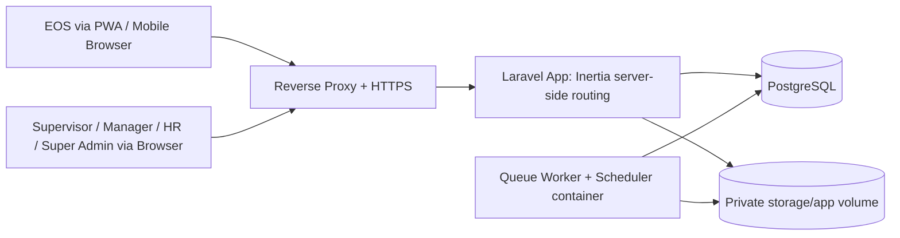

# Architecture Specification — PORTER (Portal Operasional Terpadu Sekolah Rakyat)

**Status:** Baseline MVP  
**Dokumen:** Application Architecture Specification  
**Arsitektur:** Modular monolith Laravel 13 single-app Inertia, background worker via queue/scheduler  
**Stack:** Laravel 13 + Inertia v3 + React 19 (PWA shell) + Tailwind 4; Eloquent + PostgreSQL; Laravel Queue database driver; Docker Compose (Sail).

## 1. Tujuan Arsitektur

Dokumen ini mendefinisikan struktur implementasi, boundary domain, dependency rule, transaction pattern, dan flow runtime aplikasi PORTER (Portal Operasional Terpadu Sekolah Rakyat). Dokumen ini melengkapi `prd.md`, `erd.md`, `tech-stack.md`, `ux.md`, dan `security.md`.

Tujuan utama:

- Menjaga business rule absensi (bukti kehadiran), Daily Report, inventaris, dan audit tetap konsisten serta testable.
- Mencegah business logic bocor ke controller, React page component, migration, atau queue job secara tidak terkontrol.
- Mendukung tiga environment terpisah—local development, staging, dan production—tanpa mengunci aplikasi pada desain yang sulit dipisahkan bila skala meningkat.
- Menetapkan transaction boundary untuk workflow yang kritis secara bisnis.
- Membuat domain siap untuk integrasi future tanpa membangun microservices prematur.

## 2. Architectural Decisions

```text
Architecture style : Modular monolith (single Laravel application)
Application        : Laravel 13 + Inertia v3 + React 19, server-side routing
Rendering          : Inertia::render (halaman), tanpa REST API layer terpisah, tanpa OpenAPI
Database           : PostgreSQL sebagai source of truth; Eloquent ORM + migrations (UUID PK operasional)
RBAC               : spatie/laravel-permission (5 role fixed, single role per user) + Laravel Policies + ScopeService
Audit              : spatie/laravel-activitylog (tabel activity_log)
Validation         : FormRequest di HTTP boundary + validasi eksplisit per rule di service/action
Queue              : Laravel Queue driver database; scheduler via schedule:work
Storage            : Laravel Filesystem, local disk private (storage/app, di luar public/)
Deployment         : Docker Compose (Sail); local + staging + production (ADR-030); promotion branch
```

### Why modular monolith

MVP memiliki workflow yang saling terkait dan membutuhkan transaksi kuat: attendance, Daily Report, nomor dokumen, attachment metadata, inventory transaction, dan audit log. Memecahnya menjadi microservices sejak awal akan meningkatkan network failure, distributed transaction, deployment, observability, dan operational burden tanpa manfaat yang setara.

Modular monolith di sini berarti: **satu aplikasi Laravel dengan domain yang diorganisasikan sebagai grup class Laravel** (Models + Services/Actions + Policies + Controllers + FormRequests per domain), bukan package/nuxt-module terpisah. Boundary domain dijaga lewat convention struktur class dan aturan dependency (§7), bukan lewat boundary package fisik. Skala target—200 site aktif, ~1–2 EOS per site—tidak menuntut lebih dari satu aplikasi dan satu PostgreSQL.

## 3. System Context



Komponen eksternal seperti SMTP, WhatsApp, Zabbix, cloud AP controller, MinIO/S3, dan identity provider tidak menjadi dependency MVP. Jika ditambahkan kemudian, aksesnya diisolasi di `app/Services`/`app/Jobs` terpisah dari domain inti.

Tidak ada Redis. Session, cache, rate limit, queue, dan atomic lock memakai driver `database` (PostgreSQL). PostgreSQL adalah satu-satunya runtime state store selain file storage.

## 4. Container dan Runtime Topology

```text
Public network
  └── reverse proxy / TLS
       └── laravel container: php-fpm/artisan serve (Inertia SSR + static assets + PWA shell)

Private Docker network
  ├── worker container: php artisan queue:work
  ├── scheduler container: php artisan schedule:work
  └── postgres container: PostgreSQL

Persistent volumes
  ├── postgres_data
  └── storage_data (storage/app — attachment private, di luar public/)
```

| Container | Responsibility | Public exposure | Persistent state |
|---|---|---:|---:|
| `laravel` | Inertia page rendering, Fortify auth/session, FormRequest validation, business use case, upload/download attachment, export stream, health endpoint | Via reverse proxy | Tidak (mount `storage/app` read/write) |
| `worker` | `php artisan queue:work`: thumbnail/preview attachment, notifikasi, cleanup, retry | Tidak | Tidak (mount `storage/app` read/write) |
| `scheduler` | `php artisan schedule:work`: backup pg_dump + rsync, retention/cleanup task | Tidak | Tidak |
| `postgres` | System of record: data bisnis, session, cache, queue, lock, activity_log | Tidak | `postgres_data` |

Aplikasi Laravel dan worker adalah stateless terhadap local container filesystem selain mount `storage/app` yang diakses melalui Laravel Filesystem disk `private`. Database dan storage volume tidak diekspos langsung ke publik.

### 4.1 Environment dan promotion flow

Deployment berjalan pada tiga environment terpisah (ADR-030):

- **Local development** — Docker Compose (Sail) pada workstation developer; data dummy/seed, bukan data production.
- **Staging** — topologi sama dengan production, dipakai untuk verifikasi pra-pilot/UAT dan restore test. Wajib sebelum pilot dan production release.
- **Production** — melayani user nyata.

Aturan promotion:

```text
faizaldev -> staging -> production
```

- Production deploy hanya dari branch `production`; staging dari branch `staging`.
- Staging tidak boleh memakai raw production data (gunakan data sintetis/anonimisasi terkontrol).
- Secret (`.env`) terpisah per environment; tidak ada berbagi kredensial lintas environment.
- Database migration (`php artisan migrate`) dijalankan terkontrol sebagai bagian dari deploy pipeline, bukan manual dari workstation developer.

Setiap environment menjalankan topologi container yang sama (bagian 4); perbedaannya hanya pada data, secret, dan sumber branch deploy.

## 5. Struktur Repository

Struktur mengikuti struktur Laravel standar; domain diorganisasikan sebagai grup class, bukan package terpisah:

```text
cmx-sekolah-rakyat/
├── app/
│   ├── Actions/                  # Use case write per domain (SubmitDailyReport, RecordStockMutation, ...)
│   ├── Models/                   # Eloquent models per domain
│   ├── Http/
│   │   ├── Controllers/          # Per domain: SiteController, DailyReportController, ...
│   │   ├── Middleware/           # Scope, force-change-password, request ID/log context
│   │   └── Requests/             # FormRequest validation per domain
│   ├── Policies/                 # Laravel Policies per model
│   ├── Services/                 # Domain service + ScopeService + checklist rule validator
│   ├── Jobs/                     # Queued job: GenerateAttachmentThumbnail, CleanupExpiredData, ...
│   ├── Support/                  # Helper domain-agnostic (Haversine, time, number formatting)
│   └── Providers/
├── database/
│   ├── migrations/               # Versioned Laravel migrations
│   ├── factories/                # Test data factories
│   └── seeders/                  # Role/permission seed, master data bootstrap
├── resources/js/
│   ├── pages/                    # Inertia page per domain (resources/js/pages/sites/..., daily-reports/...)
│   ├── components/               # Shared React components (shadcn/ui + domain component)
│   └── ...
├── routes/web.php                # Seluruh routing server-side (Inertia)
├── tests/                        # Pest: Unit (service/rule) + Feature (route/Inertia/transaction)
├── docker-compose.yml (Sail)
├── docs/
│   ├── prd.md, erd.md, tech-stack.md, ux.md, security.md, architecture.md
│   └── adr/
└── ...
```

`routes/web.php` adalah satu-satunya routing authority. Tidak ada `routes/api.php` — seluruh interaksi browser melewati Inertia page + form request. Command artisan (`php artisan app:bootstrap-super-admin`, dsb.) untuk operasi admin terkontrol berada di `app/Console/Commands`.

## 6. Domain Modules dan Ownership

Domain dijelaskan sebagai grup class Laravel (Models + Services/Actions + Policies + Controllers + FormRequests di direktori standar). Tidak ada package/module fisik terpisah.

| Domain | Tanggung jawab | Owns/authority | Tidak bertanggung jawab |
|---|---|---|---|
| `Identity` | User, credential (Fortify), password reset, session lifecycle, must_change_password | Status aktif user, password hash, kebijakan session/lockout | Business scope attendance/report |
| `Authorization` | Role (spatie, 5 role fixed single-role), permission mapping, Policies, ScopeService | Keputusan akses per actor/action/resource | Menyimpan business object domain |
| `Site` | Master site: nama, kode, alamat, lat/lng/radius (informasi), timezone IANA, status aktif | Konfigurasi site | Attendance record atau inventory mutation |
| `Assignment` | Penugasan EOS ke site; satu assignment aktif per EOS | Assignment lifecycle dan one-active constraint | Memindahkan inventaris site |
| `Attendance` | Check-in/clock-out sebagai bukti kehadiran: selfie + GPS + server timestamp UTC | Attendance lifecycle, jarak Haversine (informasi), unique(EOS+site+tanggal lokal) | Disiplin/late/kehadiran (urusan vendor EOS) |
| `DailyReport` | Draft, answer, submit/reopen, alokasi report number | Report lifecycle, submit transaction, snapshot | Menentukan master checklist baru |
| `Checklist` | `checklist_versions`: 1 tabel versi + struktur JSON (section/item/option), publish | Checklist master version, satu template global DAILY_SITE_REPORT | Mengubah report submitted lama |
| `Inventory` | Asset (registrasi oleh EOS, tag/SN gudang), material/sparepart, stock ledger | Asset state, stock ledger/balance | Mengelola attendance |
| `Attachment` | Metadata, upload validation sinkron, Filesystem disk private, derivative queued | Attachment lifecycle/access association | Menentukan business eligibility attendance/report |
| `Notification` | Tabel notifications Laravel (database channel) + polling; event report reopened, attachment rejected, export selesai | Delivery dan read state notifikasi | Menjadi authority status business record |
| `Export` | Export Excel/PDF/CSV sinkron streamed + preset per user + audit export | Eksekusi export sesuai scope/filter dan audit-nya | Membypass privacy visibility role |
| `Audit` | `spatie/laravel-activitylog` — activity_log persistence + query | Audit persistence dan read model | Mengizinkan/menolak business action |
| `Analytics` | Read model/aggregate/listing via Eloquent query + component | Reporting projections | Mengubah source business record |

Modul lama yang dihapus bersama perubahan stack/domain: `attendancepolicy` (window/late/periode 21–20), `calendar` (`EFFECTIVE_WORKING_DAY`), `Attendance Request` (seluruh modul), `networklink` sebagai modul terpisah (dual-link menjadi bagian master `Site` + snapshot report), `legalhold` (deferred), `outbox` (diganti Laravel Queue database driver).

### Dependency rule antar domain

- Domain service/action boleh memakai Eloquent models domain sendiri dan models domain lain secara read-only bila diperlukan untuk validasi; cross-domain **write** harus lewat service/action domain pemiliknya atau berada dalam satu transaction boundary yang eksplisit.
- Controller hanya: parse request (FormRequest sudah memvalidasi), resolve actor, memanggil action/service, `Inertia::render`/redirect/flash. Controller tidak boleh berisi query Eloquent kompleks, transaction control, validasi rule domain, alokasi nomor dokumen, atau keputusan scope.
- React page component menerima props dari controller; tidak memvalidasi business rule, tidak menghitung scope, tidak mengambil data selain via props (tidak ada data fetching client-side ke REST).
- Queue job tidak membawa business rule baru; job memanggil service/action yang sama dengan flow sinkron.
- Analytics/export bersifat read-only terhadap source data.

## 7. Request Flow: Inertia

### 7.1 Pipeline request

```text
Request
→ reverse proxy/TLS
→ Laravel HTTP kernel middleware:
    HandleCors / TrustProxies
    EncryptCookies / StartSession (driver database)
    ShareErrorsFromSession (Inertia)
    VerifyCsrfToken (semua mutation request)
    AuthenticateSession (idle 30 menit + absolute 8 jam)
    ForcePasswordChange (bila must_change_password)
    EnsureRoleAssigned (spatie)
    ScopeContext (resolve scope actor → request scope untuk query)
→ route di routes/web.php
→ Controller + FormRequest validation
→ Action/Service (+ DB::transaction bila kritis)
→ redirect back dengan flash/validation errors, atau Inertia::render halaman berikutnya
→ structured access log stdout
```

### 7.2 Inertia flow

- GET halaman: controller me-render `Inertia::render('Sites/Index', $props)`; React page di `resources/js/pages` menerima props ter-server-render.
- Form submit (POST/PUT/PATCH/DELETE): request dikirim oleh helper Inertia (`router.post` dsb.); server memvalidasi via FormRequest; kegagalan validasi di-redirect back dengan errors yang otomatis di-share ke props `errors`; sukses di-redirect (PRG) dengan flash message/`Inertia::render` halaman hasil.
- File upload: multipart via Inertia form helper; server memvalidasi sinkron (magic byte, size, hash) di FormRequest/service.
- Error bisnis (bukan validation): exception domain kustom di-cast jadi `ValidationException::withMessages` atau flash error aman — tetap redirect/PRG, tidak ada envelope JSON error REST. `code` stabil untuk test tetap dipakai sebagai key message.
- Tidak ada REST endpoint publik, tidak ada token client, tidak ada OpenAPI contract. Kontrak halaman/route/form ada di `api-contract.md` (revised).

### 7.3 Map dan Geolocation boundary

- Frontend memakai Leaflet + react-leaflet untuk **menampilkan** koordinat site, marker, dan review titik check-in/clock-out terhadap site (radius ditampilkan sebagai informasi).
- Maps bukan authority. Jarak ke site dihitung backend (Haversine di `app/Support`) dan **disimpan sebagai informasi**, bukan gerbang — tidak ada penolakan radius.
- Browser Geolocation API diakses melalui internal adapter React (`GeolocationClient`, tanpa library tambahan): `enableHighAccuracy: true`, diambil **sekali** dengan toleransi longgar; timestamp dan akurasi dikirim ke server bersama koordinat.
- GPS/client clock tidak dipercaya untuk waktu: timestamp server UTC canonical.
- Public OSM tiles hanya untuk development/pilot kecil dengan attribution; tile provider production diputuskan sebelum go-live. Google Maps/Mapbox bukan dependency wajib MVP; PostGIS tidak digunakan.

### 7.4 PWA shell dan konektivitas

- PWA installable: meng-cache app shell dan static assets saja (service worker).
- Tidak ada penyimpanan draft offline: tanpa IndexedDB draft, tombol sync, atau state gagal sinkronisasi; report authoring online-only.
- Attachment tidak dapat di-queue offline; report tidak dapat submit bila evidence wajib belum `AVAILABLE`.
- Attendance tidak dapat offline/queued. Hari tanpa kehadiran tercatat = kosongnya record (disiplin kehadiran ditangani absensi vendor EOS).

## 8. Authorization Architecture

### 8.1 Role dan permission

- `spatie/laravel-permission`, 5 role fixed: `SUPER_ADMIN`, `MANAGER`, `SUPERVISOR`, `HR`, `EOS`; **single role per user** (bukan multi-role).
- Mapping role→permission di-seed dari matriks kapabilitas/visibilitas `prd.md` §4 (seeder `RolePermissionSeeder`); seed-only pada MVP, tanpa UI admin permission.
- Otorisasi server-side memeriksa **permission code** (mis. `checklist.publish`, `report.reopen`, `inventory.adjust`) via Laravel Policies + Gate, bukan role literal di controller.
- Role tetap ENUM lima nilai; menambah permission memerlukan perubahan kode + re-seed.

### 8.2 Policies

Setiap model operasional memiliki Policy (`app/Policies`): `SitePolicy`, `DailyReportPolicy`, `AttendancePolicy`, `AssetPolicy`, `InventoryTransactionPolicy`, `AttachmentPolicy`, `ChecklistVersionPolicy`, `ExportPresetPolicy`, dsb. Policy menggabungkan permission code + ownership/scope check per record. Controller memakai `$this->authorize()`/middleware `can:`; Policy juga dipakai untuk memfilter listing di query.

### 8.3 ScopeService

`app/Services/ScopeService` menentukan visible data set per actor:

- **EOS**: hanya site dengan assignment aktif miliknya.
- **Non-EOS (SUPERVISOR/MANAGER/HR/SUPER_ADMIN)**: semua site aktif.
- ScopeService dipanggil di query listing/export dan di Policy per-record; middleware `ScopeContext` menyimpan scope di request agar controller tidak menghitung ulang.

Server tetap authoritative: UI hanya menyembunyikan/menampilkan; privacy visibility (mis. Manager tanpa raw selfie/GPS presisi) di-enforce server-side di Policy/export.

## 9. Transaction Boundaries

### 9.1 Prinsip

- Satu use case write kritis berjalan dalam satu `DB::transaction` bila perubahan harus atomic.
- Activity log ditulis pada transaction yang sama dengan perubahan bisnis (atomic: commit keduanya atau tidak sama sekali).
- Queued job di-dispatch **setelah commit** (`DB::afterCommit`) — tidak ada transactional outbox; job queue database row hanya dibuat setelah data bisnis persisted.
- Attachment binary upload dipisahkan dari business transaction; validasi sinkron di request memastikan attachment `AVAILABLE` **sebelum** action seperti report submit/clock-out gate.

### 9.2 Attendance check-in transaction

```text
1. Authenticate actor (EOS) + load active assignment/site.
2. FormRequest: validasi file selfie (format/size/magic byte) + koordinat GPS + akurasi/timestamp.
3. Simpan file selfie via Filesystem disk private + metadata attachment + hash SHA-256 → status AVAILABLE (validasi sinkron).
4. DB::transaction:
   a. Validasi unique (EOS + site + tanggal lokal) — constraint DB menolak double submit;
      record existing dengan status CHECKED_IN/COMPLETED → reject.
   b. Hitung jarak Haversine ke site (informasi, bukan gerbang).
   c. Insert attendance record: status CHECKED_IN, timestamp UTC, koordinat, jarak, timezone site snapshot,
      link ke selfie check-in.
   d. activitylog: event attendance checked-in.
5. Setelah commit: DB::afterCommit dispatch job GenerateAttachmentThumbnail (selfie).
6. Redirect back dengan hasil.
```

Clock-out mengikuti pola sama dengan gate: record harus `CHECKED_IN`, tanggal lokal sama dengan check-in, Daily Report tanggal tersebut `SUBMITTED` dan required evidence `AVAILABLE` (bila belum, arahkan EOS melengkapi report), selfie clock-out ke-2 (maksimum 1+1 per record), transisi `COMPLETED`.

### 9.3 Daily Report submit transaction

```text
1. Authenticate actor + Policy: EOS ownership/assignment atas report.
2. FormRequest: struktur jawaban sesuai checklist_version.
3. Load draft + checklist version PUBLISHED; validasi seluruh rule v1 secara eksplisit di
   DailyReportValidationService (MINOR→note wajib, MAJOR→note+evidence, NOT_CHECKED→reason,
   AP offline vs status, suhu wajib, LINK_TRAFFIC + 2 SPEEDTEST_RESULT terpisah — semua rules FR-10).
4. Validasi seluruh evidence wajib berstatus AVAILABLE (section, item, speedtest MAIN/SECONDARY, LINK_TRAFFIC).
5. DB::transaction:
   a. Re-read/lock draft (SELECT ... FOR UPDATE) untuk cegah concurrent submit.
   b. Persist/replace daily_report_answers.
   c. nextval PostgreSQL SEQUENCE global CMX.WR (bigint) — alokasi atomik.
   d. Konstruksi report_number "CMX.WR.YYYYMM.SEQUENCE" (YYYYMM dari work_date_local + timezone site).
   e. Snapshot JSONB (definisi checklist + site + EOS + network links) + timezone snapshot.
   f. Mark report SUBMITTED + report_number + submitted_at.
   g. activitylog: event daily_report.submitted (actor, report_id, nomor, versi checklist).
6. Setelah commit: DB::afterCommit dispatch job thumbnail bila ada attachment baru
   (attachment sudah AVAILABLE; thumbnail/preview via queue).
7. Redirect dengan flash sukses + nomor report.
```

Alokasi sequence tidak boleh memakai cache client/counter aplikasi. PostgreSQL SEQUENCE + transaction menjamin uniqueness dan urutan global; gap sequence (rollback) dapat diterima, duplikasi tidak.

Reopen: `DB::transaction` { validasi maks 7 hari kalender + reason + role (Supervisor/Super Admin), transisi SUBMITTED→REOPENED, increment revision (nomor tidak berubah), activitylog } + notifikasi database queue setelah commit. Resubmit menjalankan ulang flow submit (sequence baru tidak dialokasikan — nomor tetap).

### 9.4 Inventory stock mutation transaction

```text
1. Authorize actor/action/site (Policy + ScopeService).
2. FormRequest: tipe mutasi (RECEIPT/USAGE/ADJUSTMENT/DAMAGED/LOST/RETURN/TRANSFER_IN/TRANSFER_OUT),
   item, quantity, reason, evidence.
3. DB::transaction:
   a. Lock row inventory_stock (SELECT ... FOR UPDATE per site+item).
   b. Hitung saldo berikutnya; reject bila saldo negatif.
   c. Insert inventory_transactions (ledger immutable, before/after, reversal_of_mutation_id bila reversal).
   d. Update inventory_stock.quantity_on_hand.
   e. activitylog.
4. Redirect back.
```

Reversal mutasi: transaksi baru yang mereferensi mutasi asal (`reversal_of_mutation_id`); baris ledger asal tidak pernah di-update. Registrasi/perubahan status asset: transaksi beralasan + audit + foto wajib (registrasi; bila rusak/hilang).

## 10. Time dan Timezone

- Database timestamp UTC (`timestamptz`); timestamp server UTC canonical untuk semua event operasional (check-in, submit, dsb).
- Site menyimpan timezone IANA (`Asia/Jakarta`, `Asia/Makassar`, `Asia/Jayapura`) — dipakai untuk **penampilan** waktu lokal di UI dan derivasi `work_date_local` + `YYYYMM` nomor report; bukan untuk validasi jam.
- Snapshot timezone pada record attendance/report mempertahankan makna historis setelah master berubah.
- Waktu diambil dari clock server (`Carbon::now()` via helper terpusat); jam device client tidak dipercaya. Test memakai `Carbon::setTestNow()`.
- Perubahan koordinat/timezone site wajib reason + activitylog.

## 11. Dual-Link Network Site

Bagian dari master `Site` (model + `site_network_links`):

- Setiap site aktif wajib punya tepat satu `MAIN` active dan satu `SECONDARY` active. Constraint: `unique(site_id, role) where active = true`.
- Site tidak boleh aktif untuk Daily Report bila konfigurasi Main/Secondary belum lengkap.
- Konfigurasi link (provider, service, medium, subscribed capacity, periode aktif) di-snapshot ke Daily Report pada saat submit.
- Data konektivitas laporan memakai `LINK_TRAFFIC` (avg/peak inbound/outbound, unit `KBPS`/`MBPS`, `normalized_kbps` dihitung backend) dan dua item `SPEEDTEST_RESULT` terpisah untuk MAIN dan SECONDARY. Bukan utilization percentage dan bukan satu field connectivity test generic.
- Speedtest dijalankan manual oleh EOS; aplikasi hanya mencatat `route_declaration` (`TESTED_VIA_MAIN_LINK`/`TESTED_VIA_SECONDARY_LINK`) dan tidak mengklaim verifikasi otomatis actual network path.

## 12. File Storage Architecture

### 12.1 Laravel Filesystem disk

Seluruh akses file lewat Laravel Filesystem disk `private` (local driver, root `storage/app`, **di luar public/**). Tidak ada file yang disajikan dari static public path. Future: ganti konfigurasi disk ke S3-compatible tanpa mengubah kode akses (Filesystem abstraction).

### 12.2 Upload flow (validasi sinkron + thumbnail queued)

```text
Client (Inertia form multipart) preflight size/format
→ Controller + FormRequest: auth/CSRF/scope validation
→ AttachmentService validasi sinkron: magic byte, content type, size, decode-safe, hash SHA-256
→ File disimpan via disk private dengan object key server-generated (immutable)
→ Metadata attachment persisted: status AVAILABLE bila lolos, REJECTED bila gagal (gagal = reject sinkron
  dengan pesan aman, tanpa detail internal)
→ Kualifikasi association: attachment_links — satu attachment teraut tepat satu context
→ DB::afterCommit: dispatch job GenerateAttachmentThumbnail (preview WebP 2048px + thumbnail WebP 480px,
  Intervention Image, Imagick + libheif untuk HEIC)
→ Authorized user request preview/download
→ Controller validasi association + permission + activitylog (sensitive access)
→ streamed response via Storage::disk('private')->download()/stream()
```

Aturan attachment:

- Format: JPG/PNG/WebP/HEIC/PDF; maksimum 10 MB per file.
- Limit per context: report 10, section 5, item 5, selfie check-in 1 + selfie clock-out 1, mutation 5.
- Validasi tipe/format/size/decode **sinkron di request** — tidak ada quarantine async penuh, tidak ada ClamAV (ADR-044).
- Original file private dan immutable; PDF original tidak direcompress.
- Thumbnail job berjalan di worker queue dengan timeout per job; gagal derivative tidak mengubah status AVAILABLE original (preview fallback ke original/thumbnail default) dan di-retry bounded.
- Attachment rejected tidak tersedia ke user biasa; memicu activitylog + notifikasi in-app.
- Association explicit via `attachment_links`: client tidak dapat menautkan arbitrary attachment ID ke report/attendance tanpa validasi owner/scope/type. Evidence untuk context berbeda diunggah terpisah — file sama boleh diunggah ulang; satu screenshot Main Link tidak otomatis menjadi evidence Secondary Link.

## 13. Queue dan Scheduler

### 13.1 Laravel Queue (driver database)

- Job disimpan di tabel `jobs` PostgreSQL; worker = container terpisah `php artisan queue:work`.
- Dispatch job hanya setelah commit data bisnis (`DB::afterCommit`) — job tidak pernah mereferensikan data yang belum persisted.
- Tidak ada transactional outbox; delivery guarantee = at-least-once (job di-retry bila worker mati), handler job wajib idempotent.
- Retry: backoff eksponensial, bounded `tries`/`backoff` per job class; job yang melewati max attempts masuk failed jobs table (`failed_jobs`) dan men-trigger alert operasional.
- Queue channel tunggal `default` cukup untuk skala MVP.

### 13.2 Job utama

- `GenerateAttachmentThumbnail` — preview/thumbnail WebP (Intervention Image, Imagick+libheif).
- `SendDatabaseNotification` — notifikasi in-app (event report reopened, attachment rejected, export selesai).
- Cleanup: `storage:prune`/retention sementara, session/cache/queue expired records (terjadwal).

### 13.3 Scheduler

`php artisan schedule:work` (container scheduler terpisah):

- Backup harian: `pg_dump` database + `rsync` snapshot `storage/app` ke target backup (lihat §17).
- Prune cache/session/queue expired, cleanup failed jobs tua, dsb.

## 14. Audit Architecture

Audit memakai `spatie/laravel-activitylog` (tabel `activity_log`), dipasang **eksplisit di titik kritis** — bukan auto-log semua model:

- Login sukses/gagal, sensitive access (download attachment raw/GPS presisi), master change (site koordinat/timezone, checklist publish, assignment), transisi lifecycle report (submit/reopen/void), mutasi inventaris + reversal, perubahan status asset, export, reset password.
- Activity log ditulis di dalam `DB::transaction` yang sama dengan perubahan bisnis.
- Properties: actor (user), action/event, subject model, `properties` before/after yang aman, timestamp UTC, request/correlation ID.
- Redaction: password, token, secret, dan binary attachment tidak pernah masuk properties (mengikuti `security.md`).

## 15. Configuration, Migration, dan Bootstrap

### Configuration

- `.env` per environment (Sail Compose); secret terpisah per environment.
- Konfigurasi mencakup: `DB_*` (PostgreSQL), `SESSION_DRIVER=database`, `CACHE_STORE=database`, `QUEUE_CONNECTION=database`, `FILESYSTEM_DISK=private`, policy session/cookie (Secure/HttpOnly/SameSite=Lax), lockout login, upload root/limit.
- Config di-validate saat boot bila kritis (provider `AppServiceProvider` fail-fast untuk missing secret).

### Migrations

- Migrations Laravel versioned di Git (`database/migrations`); `php artisan migrate` berjalan sebagai deploy step terkontrol, bukan otomatis saat runtime production.
- Forward-only preferred; destructive change memerlukan rencana expand/migrate/contract + backup awareness.

### Bootstrap

Initial deployment via seeder/command terkontrol:

```text
- Seed 5 role + mapping permission (RolePermissionSeeder).
- Create first Super Admin via secure one-time artisan command/secret (rotate/hapus setelah setup).
- Seed master awal: site, assignment, checklist template v1 (publish), network links.
```

## 16. Observability Minimum

- Structured log (JSON) ke stdout dari container laravel/worker/scheduler (channel `stderr`).
- Request/correlation ID dipropagasi request → controller → service → activity_log/job/log context (middleware `RequestLogContext`).
- Health endpoint sederhana (mis. `/up` Laravel health route) di belakang reverse proxy: process liveness + dependency check PostgreSQL; tanpa secret/output detail.
- Export perlu audit event sebelum stream dimulai.
- Log redaction mengikuti `security.md`.

## 17. Backup dan Restore

- **pg_dump harian** terjadwal via scheduler container (retensi sesuai runbook); file dump disimpan di volume/lokasi backup terpisah dari `postgres_data`.
- **rsync attachment** terjadwal: snapshot `storage/app` (attachment private) ke target backup yang sama.
- Restore drill berkala di environment staging sebagai bagian verifikasi pra-pilot/UAT (ADR-030).
- Backup production tidak dipakai sebagai data staging (staging memakai data sintetis/anonimisasi terkontrol).

## 18. Architecture Constraints and Anti-Patterns

Berikut dilarang tanpa ADR yang disetujui:

```text
- Menaruh business rule, query kompleks, atau transaction logic di controller/React page component.
- Menambahkan REST API layer terpisah/OpenAPI untuk kebutuhan MVP (semua via Inertia).
- Memvalidasi business rule hanya di frontend React (validasi server-side wajib).
- Querying PostgreSQL langsung dari browser/React (client hanya menerima props).
- Mempercayai device clock client, koordinat GPS client sebagai timestamp, atau self-claimed role.
- Menulis source-of-truth bisnis di luar PostgreSQL (cache/session bukan authority).
- Mengupdate saldo inventaris tanpa stock transaction immutable / tanpa row lock.
- Mengedit report SUBMITTED langsung tanpa workflow reopen + audit.
- Menyimpan password, token, file binary, atau secret di activity log.
- Menyajikan attachment dari path public/static tanpa controller terkontrol + audit sensitive access.
- Memakai kredensial superuser database pada runtime aplikasi normal.
- Cross-domain write tanpa service/action + transaction boundary eksplisit.
- Menaruh dependency provider eksternal langsung di dalam service domain.
- Menandai attachment AVAILABLE tanpa lolos validasi sinkron tipe/format/size/decode (tanpa ClamAV — ADR-044).
- Menyimpan binary attachment di tabel PostgreSQL (upload ulang file sama untuk context berbeda
  adalah perilaku yang diharapkan pada single-context attachment, bukan anti-pattern).
- Offline/queued attendance, offline draft report, atau silent auto-submit draft.
- Menjalankan queue worker/scheduler dalam container aplikasi publik (harus service terpisah).
- Mendeploy production dari selain branch production, atau menjalankan migration production manual
  dari workstation developer.
- Memasang geofence gate/penolakan radius, window jam, late minutes, atau klasifikasi EARLY/ON_TIME/LATE
  pada attendance (domain disiplin = vendor EOS; sistem hanya bukti kehadiran).
- Memasang Redis atau layanan runtime state tambahan tanpa ADR.
```

## 19. Evolution Path

| Trigger | Evolution path |
|---|---|
| Attachment size/replica/backup requirements grow | Ganti Filesystem disk `private` ke S3-compatible (konfigurasi, bukan refactor kode) |
| Need enterprise SSO/MFA | Tambah OIDC identity integration di samping Fortify, pertahankan model otorisasi internal |
| Load naik | Jalankan beberapa replica container laravel/worker stateless di belakang load balancer (queue database + lock database aman untuk multi-worker) |
| Database isolation required | Pindahkan PostgreSQL ke VM terpisah/managed database dengan TLS + backup plan |
| Butuh delivery notifikasi real-time | Tambah broadcast channel; polling tetap fallback |
| High availability requirement approved | Multi-node deployment, load balancer, PostgreSQL replication, DR runbook |

## 20. Architecture Acceptance Criteria

```text
[ ] Seluruh routing server-side di routes/web.php via Inertia::render; tidak ada REST API layer/OpenAPI.
[ ] Controller hanya delivery concern; business workflow di app/Actions/app/Services.
[ ] Write workflow kritis (submit report, attendance, mutasi stok, registrasi asset) memakai DB::transaction.
[ ] Alokasi report number memakai PostgreSQL SEQUENCE di dalam transaction submit.
[ ] Activity log atomic dengan perubahan bisnis pada transaction yang sama (spatie/laravel-activitylog).
[ ] Queue job di-dispatch via DB::afterCommit; worker dan scheduler berjalan sebagai container terpisah.
[ ] PostgreSQL authoritative untuk attendance/report/inventory/audit/nomor dokumen/session/cache/queue.
[ ] Tidak ada Redis di runtime MVP (semua driver database).
[ ] ScopeService menentukan data visible per role (EOS = assignment aktif; non-EOS = semua site aktif);
    Policies memeriksa permission code, bukan role literal di controller.
[ ] Timezone site dipakai untuk penampilan/derivasi tanggal lokal; timestamp server UTC canonical.
[ ] Site aktif memiliki tepat satu MAIN dan satu SECONDARY active di site_network_links; snapshot ke report saat submit.
[ ] Jarak Haversine dihitung backend dan disimpan sebagai informasi (tanpa geofence gate/window jam/late).
[ ] Attendance unique(EOS+site+tanggal lokal); maksimum 1 selfie check-in + 1 selfie clock-out;
    clock-out hanya setelah Daily Report tanggal tsb SUBMITTED + evidence wajib AVAILABLE.
[ ] Checklist rules v1 divalidasi eksplisit per rule di service (MINOR/MAJOR/NOT_CHECKED/AP offline/suhu/
    LINK_TRAFFIC/2 SPEEDTEST_RESULT), bukan interpreter JSON generik.
[ ] Attachment hanya AVAILABLE setelah validasi sinkron (magic byte/size/decode/hash SHA-256);
    thumbnail/preview via queued job; akses file private via controller terkontrol + audit.
[ ] Export Excel/PDF/CSV streamed sinkron dengan audit sebelum stream; privacy visibility di-enforce;
    preset export per user tersimpan.
[ ] Struktur repo mengikuti struktur Laravel standar (app/Actions, app/Models, app/Policies, app/Services,
    app/Jobs, resources/js/pages, database/migrations, tests/).
[ ] Deployment Compose 3 environment dengan promotion faizaldev->staging->production;
    production hanya dari branch production; secret terpisah.
[ ] Backup pg_dump harian + rsync attachment terjadwal; restore drill di staging.
[ ] Health endpoint aktif; structured log stdout; tidak ada detail internal/secret di error response.
[ ] Semua pengecualian arsitektur memerlukan ADR terdokumentasi.
```
