# ERD — PORTER (Portal Operasional Terpadu Sekolah Rakyat)

**Status:** Final Baseline (revisi Laravel)  
**Database target:** PostgreSQL (Eloquent + migrations)  
**Konvensi waktu:** Canonical timestamp UTC; tanggal dan aturan operasional memakai timezone site.

## 1. Prinsip Model Data

- Primary key memakai UUID untuk seluruh record operasional dan master domain (Eloquent model dengan `HasUuids`); pengecualian: tabel bawaan Laravel/spatie yang secara default memakai integer/bigint (`jobs`, `cache`, `job_batches`, `failed_jobs`, tabel spatie permission) — tabel-tabel tersebut tetap memakai skema bawaan paketnya dan tidak dikustomisasi.
- Semua timestamp menggunakan `timestamptz` dan disimpan UTC.
- Setiap record operasional yang bergantung site menyimpan `site_id`; attendance dan report juga menyimpan snapshot timezone serta tanggal bisnis lokal (`work_date_local`).
- Tanpa soft delete untuk histori: assignment, attendance, daily report (submitted), stock transaction, dan activity log tidak boleh dihapus dari aplikasi. Soft delete (`deleted_at`) hanya untuk master data yang lazim (users, sites, assets) bila diperlukan.
- Lampiran disimpan pada local disk private (`storage/app`, di luar `public/`); database menyimpan metadata dan storage key. Satu attachment hanya teraut ke tepat satu context melalui `attachment_links`; evidence untuk context berbeda diunggah terpisah (file sama boleh diunggah ulang).
- Absensi adalah **bukti kehadiran** (selfie + GPS + server timestamp UTC), bukan disiplin: tidak ada kalender kerja, window jam, late minutes, klasifikasi, geofence gate, periode 21–20, job ABSENT, dan Attendance Request. Kehadiran hari tanpa absen = kosongnya record (urusan absensi vendor EOS).
- Checklist dikelola sebagai master data versioned: `checklist_templates` + `checklist_versions` dengan **struktur JSON** (section/item/option/rule); Daily Report menyimpan snapshot version saat submit.
- Audit aplikasi memakai tabel `activity_log` (spatie/laravel-activitylog) — tidak ada tabel audit buatan sendiri.
- Tanpa Redis dan tanpa transactional outbox: session, cache, queue, rate-limit, dan atomic lock memakai driver `database` (tabel bawaan Laravel).

## 2. Diagram Relasi Konseptual

```mermaid
erDiagram
    USERS ||--o{ MODEL_HAS_ROLES : has_role
    ROLES ||--o{ MODEL_HAS_ROLES : grants
    SITES ||--o{ EOS_SITE_ASSIGNMENTS : receives
    USERS ||--o{ EOS_SITE_ASSIGNMENTS : assigned_as_eos
    SITES ||--o{ SITE_NETWORK_LINKS : has
    SITES ||--o{ ATTENDANCE_RECORDS : has
    USERS ||--o{ ATTENDANCE_RECORDS : proves_presence
    SITES ||--o{ DAILY_REPORTS : has
    USERS ||--o{ DAILY_REPORTS : submits
    ATTENDANCE_RECORDS ||--o| DAILY_REPORTS : requires_for_clock_out
    CHECKLIST_TEMPLATES ||--o{ CHECKLIST_VERSIONS : versions
    DAILY_REPORTS ||--o{ DAILY_REPORT_ANSWERS : contains
    CHECKLIST_VERSIONS ||--o{ DAILY_REPORTS : snapshot_of
    DAILY_REPORTS ||--o{ ATTACHMENT_LINKS : evidenced_by
    ATTACHMENTS ||--o{ ATTACHMENT_LINKS : linked_to_contexts
    ATTACHMENTS ||--o{ ATTACHMENT_DERIVATIVES : derives
    ATTACHMENTS ||--o| ATTENDANCE_RECORDS : check_in_selfie
    ATTACHMENTS ||--o| ATTENDANCE_RECORDS : check_out_selfie
    SITES ||--o{ ASSETS : owns
    ASSET_CATEGORIES ||--o{ ASSETS : classifies
    ASSETS ||--o{ ASSET_STATUS_HISTORY : records
    SITES ||--o{ INVENTORY_STOCK : stocks
    INVENTORY_ITEMS ||--o{ INVENTORY_STOCK : defines
    SITES ||--o{ INVENTORY_TRANSACTIONS : scopes
    INVENTORY_ITEMS ||--o{ INVENTORY_TRANSACTIONS : concerns
    SITES ||--o{ INVENTORY_FINDINGS : raises
    USERS ||--o{ INVENTORY_FINDINGS : reports
    ATTACHMENTS ||--o{ INVENTORY_FINDINGS : evidences
    USERS ||--o{ NOTIFICATIONS : receives
    USERS ||--o{ EXPORT_PRESETS : saves
    USERS ||--o{ ACTIVITY_LOG : acts
```



## 3. Identity dan RBAC

RBAC memakai `spatie/laravel-permission` dengan lima role fixed: `SUPER_ADMIN`, `MANAGER`, `SUPERVISOR`, `HR`, `EOS` — satu role per user (di-seed, tanpa UI admin permission). Otorisasi detail per aksi memakai Laravel Policy per model + ScopeService; tidak ada tabel permission custom.

### `users`

Tabel users Eloquent standar (Laravel starter kit) ditambah kolom domain.

| Kolom | Tipe | Constraint/Keterangan |
|---|---|---|
| id | uuid | PK |
| name | varchar(200) | Not null; nama lengkap |
| email | varchar(254) | Unique, not null |
| email_verified_at | timestamptz | Nullable; bawaan starter kit |
| password | text | Not null; hash Argon2id (12–128 karakter plaintext policy di config) |
| employee_code | varchar(64) | Unique, nullable bila belum tersedia |
| phone | varchar(32) | Nullable |
| must_change_password | boolean | Default false; true saat password direset oleh Super Admin atau kebijakan memaksa pergantian; middleware memaksa halaman ganti password pada request berikutnya |
| password_changed_at | timestamptz | Nullable; dasar invalidasi session lama |
| is_active | boolean | Default true; false = user dinonaktifkan, semua session direvoke |
| last_login_at | timestamptz | Nullable |
| remember_token | varchar(100) | Nullable; bawaan Eloquent |
| created_at, updated_at | timestamptz | Not null |
| deleted_at | timestamptz | Nullable; soft delete Eloquent |

Lockout login (5 kegagalan per identifier/IP dalam 15 menit, lockout 15 menit) memakai rate limiter driver `database` (Laravel RateLimiter + cache table), bukan kolom pada `users`. Kejadian lockout diaudit via `activity_log`.

### Tabel spatie/laravel-permission

Skema bawaan paket, tanpa kustomisasi; role di-seed dari matriks kapabilitas/visibilitas `prd.md` §4:

- `roles` (id, name, guard_name, timestamps) — 5 row fixed, unique `(name, guard_name)`.
- `permissions` (id, name, guard_name, timestamps) — permission code di-declare di kode/seeder (mis. `checklist.publish`, `export.daily_report`); menambah permission baru memerlukan release.
- `model_has_roles` (role_id, model_type, model_id) — unique `(role_id, model_id, model_type)`; **satu role per user** (divalidasi aplikasi; role kedua ditolak).
- `model_has_permissions` (permission_id, model_type, model_id) — tidak dipakai pada MVP (permission langsung per user tidak digunakan).
- `role_has_permissions` (permission_id, role_id) — mapping role→permission hasil seed.

Catatan scope role: role non-EOS (`SUPERVISOR`, `HR`, `MANAGER`) scope-nya **semua site aktif**; role `EOS` dibatasi assignment aktif (ScopeService). Tidak ada tabel `user_site_scopes` pada MVP.

### `sessions`

Tabel session bawaan Laravel (driver `database`), tanpa kustomisasi:

| Kolom | Tipe | Constraint/Keterangan |
|---|---|---|
| id | varchar(128) | PK; session ID |
| user_id | bigint | Nullable; FK users |
| ip_address | varchar(45) | Nullable |
| user_agent | text | Nullable |
| payload | text | Not null |
| last_activity | integer | Not null; epoch detik |

Kebijakan session diimplementasikan lewat config/middleware (Secure, HttpOnly, SameSite=Lax; idle 30 menit; absolute 8 jam), bukan kolom tambahan. Logout, perubahan/reset password, dan disable user merevoke session aktif user.

## 4. Site, Network Link, dan Penugasan EOS

### `sites`

| Kolom | Tipe | Constraint/Keterangan |
|---|---|---|
| id | uuid | PK |
| site_code | varchar(64) | Unique |
| school_name | varchar(200) | Not null |
| address | text | Nullable |
| province | varchar(100) | Nullable |
| latitude | numeric(10,7) | Not null; -90 sampai 90 |
| longitude | numeric(10,7) | Not null; -180 sampai 180 |
| radius_meters | integer | Not null; default 100; **informasi tampilan** untuk jarak ke site, bukan gerbang penolakan |
| timezone | varchar(64) | Not null; IANA: `Asia/Jakarta`, `Asia/Makassar`, `Asia/Jayapura` |
| is_active | boolean | Default true |
| created_by_user_id | uuid | FK → users |
| created_at, updated_at | timestamptz | Not null |
| deleted_at | timestamptz | Nullable |

Perubahan koordinat atau timezone site wajib menyertakan reason dan menghasilkan audit event pada `activity_log`. Constraint bisnis: site tidak boleh aktif untuk operasional Daily Report apabila belum memiliki tepat satu link `MAIN` aktif dan satu link `SECONDARY` aktif pada `site_network_links`.

### `site_network_links`

Master link jaringan dual-link per site. Setiap site aktif wajib punya tepat satu `MAIN` aktif dan satu `SECONDARY` aktif.

| Kolom | Tipe | Constraint/Keterangan |
|---|---|---|
| id | uuid | PK |
| site_id | uuid | FK → sites |
| role | varchar(16) | `MAIN`, `SECONDARY` |
| provider_name | varchar(200) | Not null |
| service_name | varchar(200) | Nullable |
| connection_medium | varchar(32) | `FIBER`, `WIRELESS`, `CELLULAR`, `SATELLITE`, `OTHER` |
| subscribed_download_value | numeric(18,4) | Nullable |
| subscribed_download_unit | varchar(8) | Nullable; `KBPS`, `MBPS` |
| subscribed_upload_value | numeric(18,4) | Nullable |
| subscribed_upload_unit | varchar(8) | Nullable; `KBPS`, `MBPS` |
| active | boolean | Default true |
| effective_from | date | Not null |
| effective_to | date | Nullable |
| note | text | Nullable |
| created_by_user_id | uuid | FK → users |
| created_at, updated_at | timestamptz | Not null |

Constraint: partial unique index `unique(site_id, role) where active = true` — tepat 1 MAIN + 1 SECONDARY aktif per site aktif. Konfigurasi link disnapshot ke Daily Report (`snapshot.network_links`) saat submit.

### `eos_site_assignments`

| Kolom | Tipe | Constraint/Keterangan |
|---|---|---|
| id | uuid | PK |
| eos_user_id | uuid | FK → users |
| site_id | uuid | FK → sites |
| starts_on_local | date | Not null |
| ends_on_local | date | Nullable |
| status | varchar(32) | `ACTIVE`, `ENDED`, `CANCELLED` |
| assigned_by_user_id | uuid | FK → users |
| ended_by_user_id | uuid | FK → users, nullable |
| end_reason | text | Nullable |
| created_at, updated_at | timestamptz | Not null |

Constraint bisnis: satu EOS hanya boleh memiliki satu assignment `ACTIVE` — partial unique index pada `eos_user_id WHERE status = 'ACTIVE'`. Penempatan EOS bersifat permanen per site; inventaris melekat pada site, bukan EOS.

## 5. Absensi — Bukti Kehadiran

Absensi hanya merekam bukti kehadiran EOS di site: selfie + koordinat GPS + server timestamp UTC. Tidak ada tabel policy, periode, kalender, klasifikasi, atau Attendance Request (disiplin kehadiran ditangani absensi vendor EOS — lihat `prd.md` out of scope).

### `attendance_records`

| Kolom | Tipe | Constraint/Keterangan |
|---|---|---|
| id | uuid | PK |
| user_id | uuid | FK → users; EOS |
| site_id | uuid | FK → sites; derived dari assignment aktif, EOS tidak memilih site bebas |
| work_date_local | date | Not null; tanggal lokal site (IANA timezone snapshot) |
| site_timezone | varchar(64) | Not null; snapshot timezone site saat check-in, untuk penampilan waktu lokal di UI |
| status | varchar(32) | `NOT_CHECKED_IN`, `CHECKED_IN`, `COMPLETED` |
| check_in_at | timestamptz | Nullable; server time UTC |
| check_in_selfie_attachment_id | uuid | FK → attachments; nullable; maksimum satu selfie check-in |
| check_in_latitude | numeric(10,7) | Nullable |
| check_in_longitude | numeric(10,7) | Nullable |
| check_in_accuracy_meters | numeric(8,2) | Nullable; akurasi GPS klien saat pengambilan |
| check_in_distance_meters | numeric(10,2) | Nullable; Haversine dihitung backend — **informasi, bukan gerbang** (tanpa penolakan radius) |
| check_out_at | timestamptz | Nullable; server time UTC |
| check_out_selfie_attachment_id | uuid | FK → attachments; nullable; maksimum satu selfie clock-out |
| check_out_latitude | numeric(10,7) | Nullable |
| check_out_longitude | numeric(10,7) | Nullable |
| check_out_accuracy_meters | numeric(8,2) | Nullable |
| check_out_distance_meters | numeric(10,2) | Nullable; informasi Haversine, bukan gerbang |
| created_at, updated_at | timestamptz | Not null |

Unique: `(user_id, site_id, work_date_local)` — satu record per EOS per site per tanggal lokal; cegah double submit (check-in kedua ditolak `ALREADY_CHECKED_IN`; clock-out kedua ditolak `ALREADY_CLOCKED_OUT`; attempt gagal tetap diaudit via `activity_log`).

Aturan bisnis:

- Check-in dan clock-out harus berada pada tanggal lokal site yang sama (cross-midnight tidak didukung).
- GPS diambil sekali dengan toleransi longgar (akurasi rendah tetap diterima); jarak ke site dihitung Haversine di PHP dan disimpan sebagai informasi.
- Clock-out hanya valid setelah Daily Report tanggal tersebut `SUBMITTED` dan required evidence `AVAILABLE` (flow kontinu: arahkan EOS melengkapi report).
- Status: `NOT_CHECKED_IN` → `CHECKED_IN` → `COMPLETED`. Hari tanpa absen tidak membentuk record (tidak ada status `ABSENT` dan tidak ada job reconcile).
- Attendance wajib online; tidak dapat offline atau queued.
- Selfie absensi tidak lewat `attachment_links`: relasi selfie disimpan sebagai kolom FK langsung pada tabel ini (lihat §8).

## 6. Daily Report dan Checklist Versioned

### `checklist_templates`

| Kolom | Tipe | Constraint/Keterangan |
|---|---|---|
| id | uuid | PK |
| code | varchar(64) | Unique; MVP satu template global `DAILY_SITE_REPORT` |
| name | varchar(200) | Not null |
| created_by_user_id | uuid | FK → users |
| created_at, updated_at | timestamptz | Not null |

### `checklist_versions`

Versi checklist; **struktur section/item/option/rule disimpan sebagai JSON** pada satu kolom — menggantikan tabel relasional `checklist_sections`/`checklist_items`/`checklist_options`/`checklist_rules` (keputusan ADR-049).

| Kolom | Tipe | Constraint/Keterangan |
|---|---|---|
| id | uuid | PK |
| template_id | uuid | FK → checklist_templates |
| version_number | integer | Not null, > 0 |
| status | varchar(32) | `DRAFT`, `PUBLISHED`, `SUPERSEDED`, `RETIRED` |
| structure | jsonb | Not null; definisi lengkap section/item/option/rule versi ini (skema di bawah) |
| published_by_user_id | uuid | FK → users; Super Admin |
| published_at | timestamptz | Nullable |
| superseded_by_version_id | uuid | FK → checklist_versions, nullable |
| created_by_user_id | uuid | FK → users |
| created_at, updated_at | timestamptz | Not null |

Unique: `(template_id, version_number)`. Hanya Super Admin yang publish; versi `PUBLISHED` immutable — perubahan struktur/rule/option/order harus melalui version baru dengan lifecycle `DRAFT → PUBLISHED → SUPERSEDED/RETIRED`. Renderer/input type baru membutuhkan frontend/backend release.

Skema `structure` (ringkas, satu objek per section/item/option/rule):

```json
{
  "sections": [
    {
      "code": "ROUTER_FIREWALL",
      "name": "Router & Firewall",
      "display_order": 1,
      "evidence_required": true,
      "evidence_min_count": 1,
      "evidence_max_count": 5,
      "items": [
        {
          "code": "ROUTER_UPTIME",
          "label": "Router uptime",
          "input_type": "DURATION",
          "unit": "ms",
          "is_required": true,
          "allows_not_applicable": false,
          "allows_item_evidence": false,
          "validation": {"min": 0},
          "display_order": 1,
          "options": [{"code": "NONE", "label": "Normal", "display_order": 1}],
          "rules": [
            {"rule_type": "REQUIRE_NOTE", "condition": {"answer": "MINOR"}, "error_code": "NOTE_REQUIRED"}
          ]
        }
      ]
    }
  ]
}
```

Konvensi yang dipertahankan dari v1:

- Section baseline codes: `GENERAL_INFO` (read-only, evidence optional 0–5), `ROUTER_FIREWALL`, `ACCESS_POINT`, `INFRASTRUCTURE_ENVIRONMENT`, `CONNECTIVITY` (required 1–5; dual-link + item `LINK_TRAFFIC` per role link + dua item `SPEEDTEST_RESULT` terpisah).
- `input_type` v1: `READ_ONLY`, `DURATION`, `PERCENTAGE`, `ENUM`, `NUMBER`, `INTEGER`, `TEXT`, `BOOLEAN`, `LINK_TRAFFIC`, `SPEEDTEST_RESULT`. Reserved future (tidak dipakai v1): `COMPOSITE`, `DECIMAL`, `URL`.
- Kode item unik lintas section dalam satu versi (divalidasi aplikasi saat publish).
- `rule_type`: `REQUIRE_NOTE`, `REQUIRE_ITEM_EVIDENCE`, `REQUIRE_FIELD`, `CONSISTENCY` — dengan `condition`/`action`/`error_code` seperti contoh di atas.
- Rules v1 (FR-10) tetap berlaku penuh: `MINOR` → note wajib; `MAJOR` → note + evidence; `NOT_CHECKED` → reason; konsistensi AP offline vs status AP; suhu ruangan wajib; dsb.
- Validasi rule dieksekusi **eksplisit per rule di kode** (FormRequest/service) — struktur JSON hanya data definisi, bukan interpreter JSON generik.

### `daily_reports`

| Kolom | Tipe | Constraint/Keterangan |
|---|---|---|
| id | uuid | PK |
| report_number | varchar(128) | Unique, nullable sampai submit; format `CMX.WR.YYYYMM.SEQUENCE` (lihat bawah) |
| eos_user_id | uuid | FK → users |
| site_id | uuid | FK → sites |
| assignment_id | uuid | FK → eos_site_assignments; snapshot penugasan saat submit |
| attendance_id | uuid | FK → attendance_records; unique — satu report per attendance |
| work_date_local | date | Not null; tanggal lokal site |
| site_timezone | varchar(64) | Not null; snapshot |
| checklist_version_id | uuid | FK → checklist_versions; snapshot versi yang dipakai |
| snapshot | jsonb | Snapshot saat submit — satu kolom JSONB berisi sub-objek `checklist` (struktur section/item/option/rule versi checklist yang dipakai), `site`, `eos`, dan `network_links` (struktur rinci: data-dictionary.md §6.1) |
| status | varchar(32) | `DRAFT`, `SUBMITTED`, `REOPENED`, `VOIDED` |
| revision | integer | Default 0; bertambah pada setiap resubmit setelah reopen; nomor tidak berubah |
| submitted_at | timestamptz | Nullable; server time UTC |
| reopened_at | timestamptz | Nullable; maksimum 7 hari kalender setelah submit |
| reopened_by_user_id | uuid | FK → users; Supervisor/Super Admin |
| reopen_reason | text | Nullable; wajib saat reopen |
| created_at, updated_at | timestamptz | Not null |

Unique: `(eos_user_id, site_id, work_date_local)` untuk report operasional harian aktif. `SUBMITTED` immutable kecuali reopen; tiap transisi status diaudit via `activity_log`. Status `VOIDED` reserved — aksi governance Super Admin (alasan + audit); endpoint operasional VOIDED deferred pada MVP.

Nomor report `CMX.WR.YYYYMM.SEQUENCE` dialokasikan **hanya saat submit sukses**, atomik, memakai **PostgreSQL SEQUENCE global bigint** (mis. `daily_report_number_seq`, `nextval()` dalam transaksi submit). `YYYYMM` memakai site local date saat submit; sequence tidak reset berdasarkan bulan/tahun.

### `daily_report_answers`

Jawaban per item checklist — nilai terstruktur JSON per item.

| Kolom | Tipe | Constraint/Keterangan |
|---|---|---|
| id | uuid | PK |
| daily_report_id | uuid | FK → daily_reports |
| item_code | varchar(64) | Not null; kode item dari struktur `checklist_versions.structure` |
| value | jsonb | Nullable; nilai terstruktur per item (skema di bawah) |
| note | text | Nullable; wajib sesuai rule (mis. `MINOR`/`NOT_CHECKED`) |
| is_not_applicable | boolean | Default false |
| created_at, updated_at | timestamptz | Not null |

Unique: `(daily_report_id, item_code)`.

Skema `value` per `input_type`:

- `ENUM`: `{"option_code": "MINOR"}`
- `DURATION`/`NUMBER`/`INTEGER`/`PERCENTAGE`: `{"value": 0, "unit": "ms|%"}`
- `TEXT`/`READ_ONLY`/`BOOLEAN`: `{"value": "..."}`
- `LINK_TRAFFIC` (Utilisasi Main/Secondary Link — dua item terpisah per role link):

```json
{
  "status": "AVAILABLE|DOWN|NOT_CHECKED",
  "avg_inbound": {"value": 0, "unit": "KBPS|MBPS", "normalized_kbps": 0},
  "peak_inbound": {"value": 0, "unit": "KBPS|MBPS", "normalized_kbps": 0},
  "avg_outbound": {"value": 0, "unit": "KBPS|MBPS", "normalized_kbps": 0},
  "peak_outbound": {"value": 0, "unit": "KBPS|MBPS", "normalized_kbps": 0},
  "source": "sumber dashboard/monitoring",
  "note": "string"
}
```

- `SPEEDTEST_RESULT` (Connection Test Main/Secondary Link — dua item terpisah):

```json
{
  "status": "SUCCESS|FAILED|NOT_TESTED",
  "link_role": "MAIN|SECONDARY",
  "download": {"value": 0, "unit": "KBPS|MBPS", "normalized_kbps": 0},
  "upload": {"value": 0, "unit": "KBPS|MBPS", "normalized_kbps": 0},
  "latency_ms": 0,
  "jitter_ms": 0,
  "packet_loss_percent": null,
  "server_name": null,
  "route_declaration": "TESTED_VIA_MAIN_LINK|TESTED_VIA_SECONDARY_LINK",
  "note": "string"
}
```

Evidence item (`LINK_TRAFFIC`, `SPEEDTEST_RESULT`, item dengan `allows_item_evidence`) ditautkan via `attachment_links` context `DAILY_REPORT_ITEM`. Evidence Section (bukti akhir setiap section) via context `DAILY_REPORT_SECTION` — source of truth tetap `attachment_links` (§8), tanpa tabel evidence terpisah. Info Umum optional (0–5); section operasional required (1–5 attachment `AVAILABLE`).

## 7. Inventaris

### `asset_categories`

| Kolom | Tipe | Constraint/Keterangan |
|---|---|---|
| id | uuid | PK |
| code | varchar(64) | Unique |
| name | varchar(120) | Not null |
| is_active | boolean | Default true |
| created_at, updated_at | timestamptz | Not null |

### `assets`

Aset didaftarkan oleh **EOS** saat barang datang dari gudang Comtronics (bukan Supervisor). Asset tag dan serial number sudah ada dari gudang — EOS input apa adanya; sistem hanya memvalidasi format (regex CMX) dan keunikan. Barang tidak berpindah antar site; rusak → dikembalikan ke gudang.

| Kolom | Tipe | Constraint/Keterangan |
|---|---|---|
| id | uuid | PK |
| site_id | uuid | FK → sites; inventaris dimiliki site, bukan EOS |
| category_id | uuid | FK → asset_categories |
| asset_tag | varchar(100) | Unique, not null; format `CMX.{SITE_CODE}.{CATEGORY}.{SEQ}` (regex CMX divalidasi server; SEQ padding minimal 4 digit) — diinput dari gudang, tidak digenerate sistem |
| name | varchar(200) | Not null |
| brand | varchar(120) | Nullable |
| model | varchar(120) | Nullable |
| serial_number | varchar(160) | Nullable; wajib bila tersedia pada perangkat |
| status | varchar(32) | `IN_USE`, `SPARE`, `RETURNED`, `DAMAGED`, `LOST`, `DISPOSED` |
| installation_location | varchar(255) | Nullable: gedung/lantai/ruang/rack |
| notes | text | Nullable |
| registered_by_user_id | uuid | FK → users; EOS pendaftar saat registrasi |
| registered_at | timestamptz | Not null; waktu registrasi |
| created_at, updated_at | timestamptz | Not null |
| deleted_at | timestamptz | Nullable |

Constraint layanan: minimal satu attachment `ASSET_REGISTRATION_PHOTO` (foto wajib saat registrasi) teraut sebelum aset selesai didaftarkan.

### `asset_status_history`

Histori perubahan status aset — setiap transisi beralasan, diaudit (`activity_log`), dan menyertakan foto bila rusak/hilang.

| Kolom | Tipe | Constraint/Keterangan |
|---|---|---|
| id | uuid | PK |
| asset_id | uuid | FK → assets |
| from_status | varchar(32) | Not null |
| to_status | varchar(32) | Not null; `IN_USE`, `SPARE`, `RETURNED`, `DAMAGED`, `LOST`, `DISPOSED` |
| reason | text | Not null; wajib untuk setiap transisi |
| photo_attachment_id | uuid | FK → attachments, nullable; wajib bila `to_status` = `DAMAGED`/`LOST` |
| changed_by_user_id | uuid | FK → users |
| created_at | timestamptz | Not null |

Baris append-only; transisi disimpan bersama audit event dalam satu database transaction.

### `inventory_items`

Master material/sparepart yang dikelola berbasis kuantitas.

| Kolom | Tipe | Constraint/Keterangan |
|---|---|---|
| id | uuid | PK |
| sku | varchar(100) | Unique |
| name | varchar(200) | Not null |
| category | varchar(100) | Nullable |
| unit_of_measure | varchar(32) | Not null; contoh `pcs`, `meter`, `box` |
| minimum_stock | numeric(18,3) | Nullable |
| is_active | boolean | Default true |
| created_at, updated_at | timestamptz | Not null |

### `inventory_stock`

| Kolom | Tipe | Constraint/Keterangan |
|---|---|---|
| id | uuid | PK |
| site_id | uuid | FK → sites |
| item_id | uuid | FK → inventory_items |
| quantity_on_hand | numeric(18,3) | Not null, default 0; **tidak boleh negatif** (check constraint) |
| created_at, updated_at | timestamptz | Not null |

Unique: `(site_id, item_id)`.

### `inventory_transactions`

Ledger mutasi stok — immutable; perubahan salah diatasi dengan reversal, bukan edit/delete.

| Kolom | Tipe | Constraint/Keterangan |
|---|---|---|
| id | uuid | PK |
| site_id | uuid | FK → sites |
| item_id | uuid | FK → inventory_items; pasangan `(site_id, item_id)` merujuk baris unik `inventory_stock` |
| transaction_type | varchar(32) | `RECEIPT`, `USAGE`, `ADJUSTMENT`, `DAMAGED`, `LOST`, `RETURN`, `TRANSFER_IN`, `TRANSFER_OUT` |
| quantity_delta | numeric(18,3) | Tidak boleh 0; tanda konsisten dengan type |
| quantity_before | numeric(18,3) | Not null |
| quantity_after | numeric(18,3) | Not null; >= 0 |
| occurred_at | timestamptz | Not null; server time UTC |
| reason | text | Not null; `ADJUSTMENT`, `DAMAGED`, `LOST`, `TRANSFER_*` wajib catatan |
| reference_type | varchar(64) | Nullable |
| reference_id | uuid | Nullable |
| reversal_of_mutation_id | uuid | FK → inventory_transactions, nullable; compensating mutation |
| performed_by_user_id | uuid | FK → users; Supervisor dapat post langsung untuk site scope-nya tanpa approval Manager pada MVP |
| created_at | timestamptz | Not null |

### `inventory_findings`

Temuan inventaris yang dilaporkan EOS (atau actor berwenang) untuk site-nya; terpisah dari mutasi stok dan tidak memodifikasi asset/saldo langsung.

| Kolom | Tipe | Constraint/Keterangan |
|---|---|---|
| id | uuid | PK |
| site_id | uuid | FK → sites; EOS tidak boleh memilih site bebas (derived dari assignment aktif) |
| reported_by_user_id | uuid | FK → users; immutable |
| asset_id | uuid | FK → assets, nullable; bila ada wajib milik site yang sama |
| stock_item_id | uuid | FK → inventory_stock, nullable; bila ada wajib milik site yang sama |
| finding_type | varchar(64) | `ASSET_DAMAGED`, `ASSET_MISSING`, `ASSET_DATA_MISMATCH`, `STOCK_LOW`, `STOCK_DAMAGED`, `ASSET_REGISTRATION_NEEDED`, `OTHER` |
| description | text | Not null; sanitized bounded text |
| status | varchar(32) | `OPEN`, `UNDER_REVIEW`, `RESOLVED`, `CLOSED`, `REJECTED` |
| reviewed_by_user_id | uuid | FK → users, nullable |
| resolution_note | text | Nullable; wajib sesuai policy untuk resolve/close/reject |
| resolution_reference_type | varchar(64) | Nullable; referensi mutasi/aksi inventory bila ada |
| resolution_reference_id | uuid | Nullable |
| reported_at | timestamptz | Not null |
| reviewed_at | timestamptz | Nullable |
| resolved_at | timestamptz | Nullable |
| closed_at | timestamptz | Nullable |
| created_at, updated_at | timestamptz | Not null |

Indeks: `(site_id, status)`. Evidence ditautkan via `attachment_links` context `INVENTORY_FINDING` (maksimum 5, status `AVAILABLE` wajib).

## 8. Attachment, Evidence Link, dan Activity Log

### `attachments`

| Kolom | Tipe | Constraint/Keterangan |
|---|---|---|
| id | uuid | PK |
| attachment_type | varchar(64) | `CHECK_IN_SELFIE`, `CHECK_OUT_SELFIE`, `SECTION_EVIDENCE`, `ITEM_EVIDENCE`, `LINK_TRAFFIC_EVIDENCE`, `SPEEDTEST_EVIDENCE`, `AP_CLOUD_EVIDENCE`, `ANOMALY_LOG`, `FINDING_EVIDENCE`, `ASSET_REGISTRATION_PHOTO`, `ASSET_STATUS_PHOTO`, `MUTATION_EVIDENCE`, `OTHER` — allowlist divalidasi server |
| original_filename | varchar(255) | Not null; hanya metadata, bukan path |
| content_type | varchar(128) | Not null; hasil validasi server: JPG/JPEG, PNG, WebP, HEIC/HEIF, PDF |
| size_bytes | bigint | Not null; <= 10 MB |
| storage_key | text | Unique, not null; server-generated; file pada local disk private `storage/app` |
| checksum_sha256 | char(64) | Not null; dihitung saat validasi sinkron |
| status | varchar(32) | `AVAILABLE`, `REJECTED` |
| rejection_reason | text | Nullable; untuk `REJECTED` |
| metadata | jsonb | EXIF yang aman, dimensi, dan metadata lainnya |
| uploaded_by_user_id | uuid | FK → users |
| uploaded_at | timestamptz | Not null; waktu upload |
| created_at, updated_at | timestamptz | Not null |

Pipeline: **validasi sinkron dalam request** (magic byte, size, hash SHA-256, decode-safe) → lolos = langsung `AVAILABLE`; gagal = `REJECTED` (tidak tersedia ke user biasa, audit event via `activity_log`). Thumbnail/preview dibuat **queued job** (Intervention Image; Imagick + libheif untuk HEIC). Original immutable/private; semua download via controller terkontrol, diotorisasi, dan diaudit. Tidak ada malware scan (ADR-044 tetap).

### `attachment_derivatives`

Derivative image yang dibuat queued job.

| Kolom | Tipe | Constraint/Keterangan |
|---|---|---|
| id | uuid | PK |
| attachment_id | uuid | FK → attachments |
| variant_type | varchar(32) | `PREVIEW` (WebP max 2048 px), `THUMBNAIL` (WebP max 480 px) |
| storage_key | text | Unique, not null |
| content_type | varchar(128) | Not null; WebP |
| width | integer | Not null |
| height | integer | Not null |
| size_bytes | bigint | Not null |
| created_at | timestamptz | Not null |

Unique: `(attachment_id, variant_type)`. PDF original tidak direcompress otomatis (tanpa derivative pada MVP).

### `attachment_links`

Satu attachment hanya teraut ke tepat satu context (relasi 1-baris-per-attachment); evidence untuk context berbeda diunggah terpisah, file sama boleh diunggah ulang.

| Kolom | Tipe | Constraint/Keterangan |
|---|---|---|
| id | uuid | PK |
| attachment_id | uuid | FK → attachments |
| context_type | varchar(64) | `DAILY_REPORT`, `DAILY_REPORT_SECTION`, `DAILY_REPORT_ITEM`, `INVENTORY_MUTATION`, `INVENTORY_FINDING`, `ASSET` |
| context_id | uuid | Not null; ID entitas tujuan |
| linked_by_user_id | uuid | FK → users |
| linked_at | timestamptz | Not null |

Unique: `(attachment_id)` — satu attachment tepat satu context. Indeks gabungan: `(context_type, context_id)`. Batas per context: section 5, item 5, inventory mutation 5, inventory finding 5, total per Daily Report 10 (hitungan sederhana, tanpa dedup lintas context).

Prinsip dual representation evidence: **`attachment_links` adalah source of truth relasi evidence** pada sistem. Konsekuensi:

- Tidak ada tabel evidence terpisah per domain; batas per Evidence Section dihitung langsung dari `attachment_links` dengan context `DAILY_REPORT_SECTION` (plus 5 per item `DAILY_REPORT_ITEM`, total 10 per Daily Report).
- **Selfie absensi TIDAK lewat `attachment_links`**: relasi selfie disimpan sebagai kolom FK langsung pada `attendance_records` (`check_in_selfie_attachment_id` / `check_out_selfie_attachment_id` — lihat §5); batas 1 selfie check-in + 1 selfie clock-out.

### `activity_log`

Audit event aplikasi memakai tabel bawaan `spatie/laravel-activitylog` — dipasang di titik kritis eksplisit: login/lockout, akses/download data sensitif (selfie, precise GPS, evidence), perubahan master (site koordinat/timezone, checklist publish, assignment), keputusan finding, export, void/reopen report, perubahan status aset.

| Kolom | Tipe | Constraint/Keterangan |
|---|---|---|
| id | bigint | PK (skema bawaan spatie) |
| log_name | varchar(255) | Nullable; nama log/kategori event |
| description | text | Not null; kode event, mis. `SITE_COORDINATES_UPDATED`, `ATTACHMENT_REJECTED`, `EXPORT_REQUESTED`, `DAILY_REPORT_REOPENED` |
| subject_type | varchar(255) | Nullable; morph type entitas tujuan |
| subject_id | varchar(36) | Nullable; morph key (UUID) |
| causer_type | varchar(255) | Nullable; morph type actor (users; null untuk system action) |
| causer_id | varchar(36) | Nullable; morph key actor |
| properties | jsonb | Nullable; before/after sanitized, request id, IP, user agent — no secret/binary |
| created_at, updated_at | timestamptz | Not null |

Append-only pada layer aplikasi; akses hapus dilarang. Tidak menyimpan password, secret, session payload, atau binary attachment. Semua akses/download sensitive evidence menghasilkan audit event. Event export ditulis sebelum stream dimulai.

## 9. Notification dan Export

### `notifications`

Tabel notifications bawaan Laravel (database channel) + polling; in-app only (email/WhatsApp out of scope).

| Kolom | Tipe | Constraint/Keterangan |
|---|---|---|
| id | char(36) | PK; UUID bawaan Laravel |
| type | varchar(191) | Not null; notification class |
| notifiable_type | varchar(191) | Not null; morph (users) |
| notifiable_id | bigint | Not null; morph key |
| data | jsonb | Not null; payload tipe + referensi entity terkait, sanitized |
| read_at | timestamptz | Nullable |
| created_at, updated_at | timestamptz | Not null |

Event MVP: report reopened, attachment rejected. Notification bukan authority — source record dan activity log adalah authority.

### `export_presets`

Preset export per user (dipakai ulang): pilihan format + kolom + filter.

| Kolom | Tipe | Constraint/Keterangan |
|---|---|---|
| id | uuid | PK |
| user_id | uuid | FK → users; pemilik preset |
| name | varchar(100) | Not null |
| data_type | varchar(64) | Not null; `ATTENDANCE`, `DAILY_REPORT`, `INVENTORY`, `ASSET`, `INVENTORY_FINDING` |
| format | varchar(16) | Not null; `XLSX`, `PDF`, `CSV` — format output tersimpan pada preset |
| columns | jsonb | Not null; daftar kolom terpilih (checkbox per kolom) |
| filters | jsonb | Not null; filter periode/site/status/EOS |
| created_at, updated_at | timestamptz | Not null |

Unique: `(user_id, name)`. Export berjalan **sinkron (streamed)** dengan audit event ke `activity_log` sebelum stream dimulai; format: Excel (xlsx styled), PDF formal, CSV (data mentah). Export sesuai matriks role `prd.md` §4: Super Admin penuh; Manager (lintas-site scope), Supervisor (site scope), HR (hanya `ATTENDANCE`, kehadiran sesuai otorisasi). Privacy visibility di-enforce — Manager tidak boleh export raw selfie/precise GPS/sensitive attachment. Tidak ada tabel `export_jobs`.

### Legal hold (deferred)

Tabel `legal_holds` dan endpoint legal hold tidak dibuat pada MVP — deferred, built when retention/purge automation is implemented. Visibility matrix data sensitif tetap berlaku penuh.

## 10. Restore Test Log

### `restore_tests`

Log hasil restore test bulanan di staging (operator Super Admin/ops). Opsional bila restore test dicatat di luar aplikasi.

| Kolom | Tipe | Constraint/Keterangan |
|---|---|---|
| id | uuid | PK |
| test_date | date | Not null |
| environment | varchar(32) | Not null; baseline `STAGING` |
| scope | varchar(200) | Not null; PostgreSQL/attachment volume |
| performed_by_user_id | uuid | FK → users, nullable (operator) |
| started_at | timestamptz | Not null |
| completed_at | timestamptz | Nullable |
| duration_minutes | integer | Nullable |
| outcome | varchar(32) | `PASSED`, `FAILED`, `PARTIAL` |
| notes | text | Nullable |
| created_at | timestamptz | Not null |

## 11. Queue dan Idempotency

Background job memakai Laravel Queue driver `database` + Scheduler — **tanpa transactional outbox** (ADR-048). Worker terpisah: `php artisan queue:work` + `php artisan schedule:work`.

Tabel bawaan Laravel (skema standar, tanpa kustomisasi):

- `jobs` (id bigint, queue, payload, attempts, reserved_at, available_at, created_at)
- `job_batches` (id varchar, name, total_jobs, pending_jobs, failed_jobs, failed_job_ids, options, cancelled_at, created_at, finished_at)
- `failed_jobs` (id bigint, uuid, connection, queue, payload, exception, failed_at)
- `cache` (key string PK, value, expiration) dan `cache_locks` (key, owner, expiration) — untuk rate limit/atomic lock driver database.

Job wajib idempotent (at-least-once): job thumbnail attachment, job notifikasi, job scheduler.

## 12. Indeks Rekomendasi

- `attendance_records(site_id, work_date_local)` untuk dashboard site per hari.
- `attendance_records(user_id, work_date_local DESC)` untuk histori EOS.
- `daily_reports(site_id, work_date_local DESC, status)` untuk daftar laporan.
- `daily_reports(eos_user_id, work_date_local DESC)` untuk histori EOS.
- `daily_report_answers(daily_report_id)` dan indeks JSON sesuai kebutuhan analitik.
- `site_network_links(site_id, role) where active = true` sebagai partial unique index.
- `assets(site_id, status, category_id)` untuk inventory site.
- `inventory_stock(site_id, item_id)` sebagai unique index.
- `inventory_findings(site_id, status)` untuk daftar finding unresolved per site.
- `notifications(notifiable_type, notifiable_id, read_at)`.
- `activity_log(subject_type, subject_id, created_at DESC)` dan `activity_log(causer_type, causer_id, created_at DESC)` (via package index).
- `attachment_links(context_type, context_id)`.
- `export_presets(user_id)` untuk daftar preset milik user.

## 13. Constraint dan Implementasi Penting

1. Timestamp absensi adalah server time UTC; koordinat GPS dan akurasi disimpan sebagai bukti; jarak Haversine dihitung backend dan disimpan **sebagai informasi** — tidak ada penolakan radius, tidak ada gate window jam. Database menyimpan nilai dan evidence, bukan mengambil keputusan dari frontend.
2. `report_number` dibuat hanya saat submit sukses, dialokasikan atomik via `nextval()` PostgreSQL sequence; sequence global tidak reset.
3. Daily Report submitted disimpan bersama snapshot struktur checklist version, site, EOS, dan network links supaya perubahan master data tidak mengubah interpretasi laporan lama.
4. Selfie tidak boleh diwakili sekadar URL dari client; gunakan attachment terotorisasi dan verifikasi tipe/ukuran file di server. Maksimum satu selfie check-in dan satu selfie clock-out per attendance.
5. Penghapusan attendance, report submitted, stock transaction, dan activity log tidak diizinkan melalui aplikasi. Gunakan void/reversal/state transition bila diperlukan.
6. Perubahan saldo stok tidak boleh langsung mengubah `quantity_on_hand`; harus melalui `inventory_transactions` dalam database transaction dengan row lock; saldo tidak boleh negatif; ledger immutable (reversal via `reversal_of_mutation_id`).
7. Untuk status `DOCUMENTATION AP CLOUD`, sistem memvalidasi minimal satu attachment `AP_CLOUD_EVIDENCE` pada report/answer sebelum submit.
8. Submit Daily Report ditolak apabila required evidence belum `AVAILABLE`; semua required evidence harus lolos validasi sinkron (upload, validasi, dan submit dalam request yang sama). Section operasional wajib minimal satu attachment `AVAILABLE`; Info Umum optional.
9. Clock-out hanya valid setelah Daily Report tanggal tersebut `SUBMITTED` dan required evidence `AVAILABLE`.
10. Unique constraints kunci: satu attendance per `(user_id, site_id, work_date_local)`; satu Daily Report aktif per `(eos_user_id, site_id, work_date_local)`; satu link aktif per `(site_id, role) where active`; satu assignment `ACTIVE` per EOS; satu role per user.
11. Checklist version `PUBLISHED` immutable; perubahan struktur checklist harus melalui version baru dengan lifecycle `DRAFT → PUBLISHED → SUPERSEDED/RETIRED`. Validasi rule dieksekusi eksplisit per rule di kode (FormRequest/service), bukan interpreter JSON generik.
12. Export berjalan sinkron (streamed) tanpa tabel export jobs; audit export direkam ke `activity_log` sebelum stream dimulai. Purge/retention dan gate `legal_holds` deferred.
13. Critical business write (attendance, report, mutasi stok, perubahan status aset) dan audit event terkait ditulis atomik dalam satu PostgreSQL transaction; job background (thumbnail, notifikasi) idempotent via Laravel Queue database driver.
